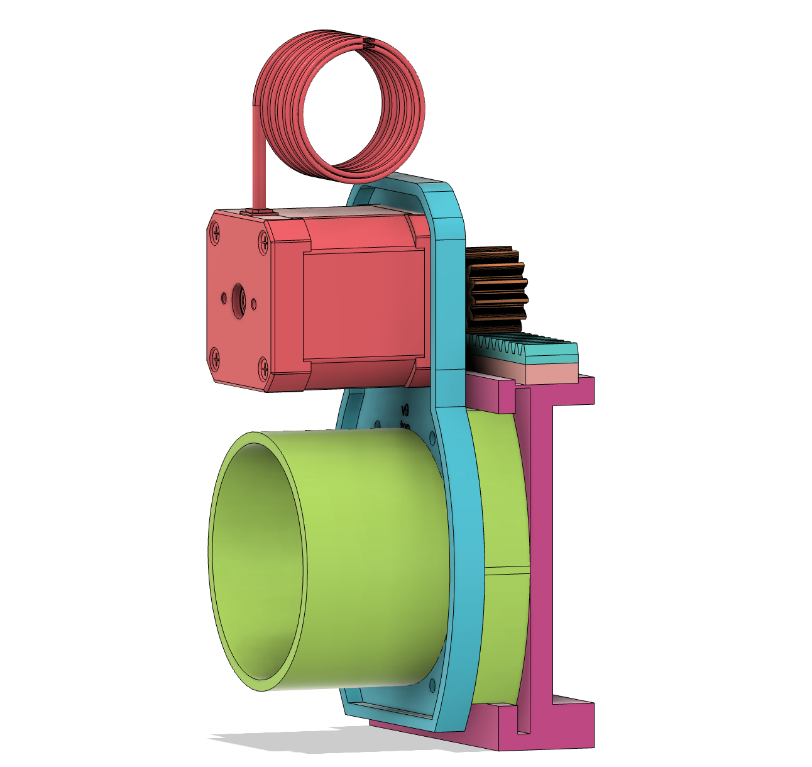

# DustGate

This project is a work in progress and is not considered complete or ready for use. Use at your own risk.

Automated dust collection manifold for a woodworking shop. A motorized rack-and-pinion linear actuator selects which blast gate is open based on which tool is running — no switches, no manual intervention.

Each tool plugs into a [Shelly smart outlet](https://us.shelly.com). When a tool draws power above a configurable wattage threshold, the actuator moves to that tool's blast gate automatically. When all tools are off, it returns to the home (closed) position. A setup wizard (AI chat-based or manual step-by-step) walks you through configuration from a phone browser.

---

## Hardware



| Part | Source | Notes |
|------|--------|-------|
| Adafruit ESP32-S2 Feather | [Adafruit #5000](https://www.adafruit.com/product/5000) | Main controller |
| Adafruit TMC2209 Breakout | [Adafruit #6121](https://www.adafruit.com/product/6121) | Stepper driver |
| LDO-42STH48-2004MAH (NEMA 17) | Various | Stepper motor |
| Rack & pinion | 3d Printed | 20T rack, 15T pinion, 4.145mm pitch |
| Mechanical Assembly | 3d printed | Integrates with COTS dust gate |
| NC mechanical limit switch | Various | Home endstop on D10 |
| Shelly Plug US (one per tool) | [us.shelly.com](https://us.shelly.com) | ~$21 each, Gen 4 recommended |
| Shelly Plug US (dust collector) | [us.shelly.com](https://us.shelly.com) | One more to switch the dust collector on/off |
| 12–24V DC power supply (≥2A) | Various | Motor power |

The reference build is a 2.5" dust port system, with adjacent gates spaced about 89mm apart. A 4" variant is planned but not yet built or measured — the setup wizard asks which size you have so the UI can seed a reasonable starting estimate either way.

For wiring details see [`linear_actuator/WIRING.md`](linear_actuator/WIRING.md).

---

## Shelly Smart Plug Setup

Do this before first boot of DustGate.

**1. Add each plug to your WiFi network**

Download the Shelly app (iOS / Android) and follow the in-app pairing flow for each plug. You only need to do this once per plug.

**2. Assign static IP addresses**

This is important — DustGate polls outlets by IP. If a plug gets a new IP from DHCP the mapping breaks.

In your router's admin panel, find the "DHCP reservations" or "static leases" section. Locate each Shelly by its MAC address (shown in the Shelly app under Device Info) and pin it to a fixed address, e.g.:

```
Bandsaw      → 192.168.1.101
Router Table → 192.168.1.102
Drill Press  → 192.168.1.103
```

**3. Confirm local control is enabled**

In the Shelly app go to each device → Settings → make sure "Local control" is on. It's on by default. Cloud access is not required.

**4. Verify reachability**

From any browser on your home network, visit:

```
http://<plug-ip>/rpc/Switch.GetStatus?id=0
```

You should get a JSON response containing `"apower": 0.0` (watts currently drawn). If you see that, the plug is ready.

> **Generation note:** Shelly Plug US Gen 4 is a Gen 2 device (uses the `/rpc/` API). When the DustGate setup assistant asks for the generation, answer **2**.

> **240V tools:** Plug-in Shelly outlets are 120V/15A only. Large table saws, planers, etc. cannot use this method — assign them a fixed gate or detect them separately.

---

## Software Prerequisites

- [PlatformIO](https://platformio.org/) (VS Code extension or CLI)
- [Node.js](https://nodejs.org/) 18+ and npm (for the web UI)
- An Anthropic API key (`sk-ant-...`) if you want the AI setup assistant

---

## Build & Flash

### 1. Clone / open the project

Open the project folder in VS Code with the PlatformIO extension installed.

### 2. Configure `config.h`

Open `linear_actuator/config.h`. At minimum:

```cpp
// Set the number of blast gates in your shop (1–7)
#define NUM_STOPS  4

// Enable smart outlet control and the HTTP API
#define CONTROL_SMART_OUTLET
#define ENABLE_HTTP_API
```

For developer / fixed-network builds you can hardcode WiFi credentials:

```cpp
#define WIFI_STA_SSID  "your-network-name"
#define WIFI_STA_PASS  "your-password"
```

Leave those commented out for end-user deployments (the setup portal handles it).

### 3. Flash the firmware

```bash
pio run --target upload
```

### 4. Build and upload the web UI

```bash
cd dustgate-ui
npm install          # first time only
bash deploy.sh       # builds Angular app, gzips assets, copies to linear_actuator/data/
cd ..
pio run --target uploadfs
```

---

## First Boot

1. **Power on the device.** Open a serial monitor (`pio device monitor`) to see boot output.

2. **Connect to the setup network.** If no WiFi credentials are stored, the ESP32 creates a hotspot:

   ```
   SSID:     DustGate-Setup
   Password: (none)
   ```

   Connect your phone or laptop to this network, then open **http://192.168.4.1** in a browser.

3. **Fill in the setup form:**
   - Your home WiFi SSID and password
   - Your Anthropic API key (optional — enables the AI setup assistant)

4. **Save & Connect.** The device reboots and joins your home network. The IP address is printed to serial:

   ```
   [WiFi] Connected. IP: 192.168.1.42
   [WiFi] Web UI:       http://192.168.1.42
   [WiFi] Setup assistant available at  http://192.168.1.42/#/setup
   ```

5. **Open the web UI** at the IP shown. You'll land on the dashboard.

---

## Setup Assistant

On first run, the dashboard will say "Not configured" — no tools have been mapped yet. You'll be offered two ways to set up:

- **AI Setup** — a chat interface powered by Claude that walks you through everything conversationally, including adjusting on the fly if a jog moved more or less than expected.
- **Manual Setup** — a step-by-step wizard with no AI involved, for the same result via explicit forms and jog buttons.

Both wizards cover the same ground:

1. Confirm your port size (2.5" or 4") — just seeds a starting estimate for gate spacing.
2. Home the actuator to establish a reference position.
3. Walk through each blast gate position — jogging the actuator to align it, then asking what tool is connected there ("Bandsaw", "Router Table", etc. — whatever you call it).
4. Ask for the IP address of the Shelly outlet for each tool and confirm it's reachable.
5. Save the configuration.

When setup is complete, tap the back arrow to return to the dashboard. Your tool buttons will appear.

---

## Daily Use

- **Automatic mode:** just turn on a tool. DustGate detects power draw within ~1 second and moves the gate. Turn the tool off and the gate returns home after a 3-second coast-down delay.
- **Manual override:** tap any tool button on the dashboard to move the gate manually. Automatic mode resumes the next time a tool is detected.
- **HOME button:** closes all gates (moves to home position).
- **Dust collector:** driven by a dedicated switchable Shelly smart plug. It turns on automatically whenever a gate is open (a tool is running) and off when the system returns home, and can also be toggled on/off manually from the dashboard.

---

## Reconfiguration

To add, remove, or reassign outlets: tap the **⚙ gear icon** (AI Setup) or **Manual Setup** button on the dashboard header — both are available any time, not just on first run. Changes take effect immediately and are saved to flash.

To reset WiFi credentials (e.g. new router): type `wifireset` in the serial monitor, or use the `wifireset` command in the serial debug interface. The Anthropic API key is preserved across WiFi resets.

---

## Development

To work on the web UI against a live device:

1. Set the ESP32's IP in `dustgate-ui/proxy.conf.json` (change the `target` values).
2. Run the dev server:
   ```bash
   cd dustgate-ui
   npm start
   ```
3. Open http://localhost:4200 — API calls proxy to the real device.

---

## Project Structure

```
linear_actuator/         Firmware (Arduino / PlatformIO)
  config.h               All compile-time settings
  linear_actuator.ino    Main sketch + state machine
  api/                   HTTP REST + WebSocket server
  control/               Control input modes (serial, outlet, rotary)
  feedback/              Homing and position feedback
  motor/                 TMC2209 stepper driver
  outlets/               Shelly outlet polling
  training/              Calibration storage
  utils/                 WiFi provisioning, motion math
  data/                  LittleFS filesystem image (generated — don't edit)
  WIRING.md              Wiring reference

dustgate-ui/             Web UI (Angular 17) — see dustgate-ui/README.md for
                         local dev instructions and a full breakdown

tools/                   Dev tools — mock-api.js (local firmware stand-in),
                         provisioning utilities

api/                     Vercel serverless function (proxies the AI setup
                         assistant's Claude calls for the hosted demo)

docs/                    Design notes and reference images

platformio.ini           PlatformIO build config
REQUIREMENTS.md          Architecture decisions and spec
vercel.json              Vercel deployment config (demo site)
```

---

## Limitations & Known Issues

- HTTPS to the Anthropic API uses `setInsecure()` (no certificate validation). Acceptable for local network use; must be addressed before any cloud deployment.
- The dust collector is controlled by a switchable Shelly plug (configured via `PUT /api/dustcollector` with `{"gen":2,"ip":"192.168.1.x"}`). It follows gate state automatically and can be toggled manually from the dashboard. A setup-wizard step to enter the plug's IP is not yet wired up (configure it via the API for now).
- 240V tools cannot use Shelly plug-in outlets.
