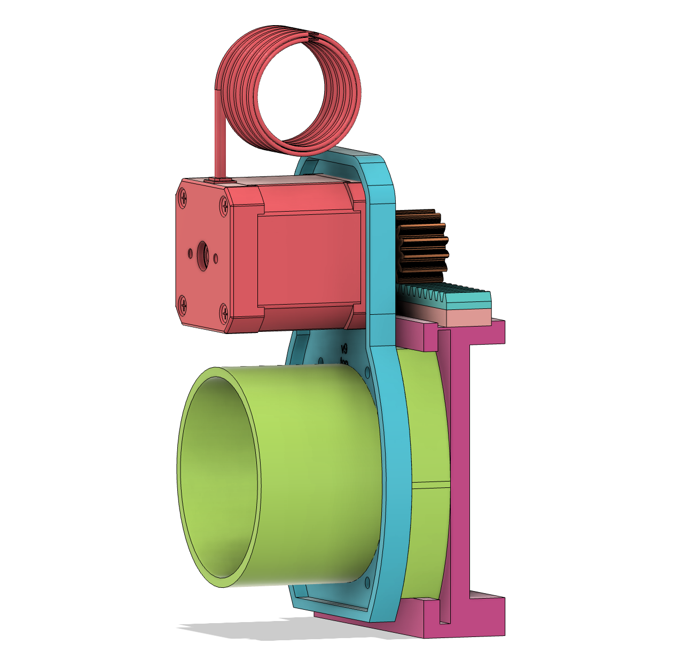

# DustGate

This project is a work in progress and is not considered complete or ready for use. Use at your own risk.

Automated dust collection manifold for a woodworking shop. A motorized rack-and-pinion linear actuator selects which blast gate is open based on which tool is running — no switches, no manual intervention.

Each tool plugs into a [Shelly smart outlet](https://us.shelly.com). When a tool draws power above a configurable wattage threshold, the actuator moves to that tool's blast gate automatically. When all tools are off, it returns to the home (closed) position. You lay the shop out once on a canvas in a phone browser — collector, ducts, gates, tools — and the controller routes from that.

---

## Hardware



| Part | Source | Notes |
|------|--------|-------|
| Adafruit ESP32-S2 Feather | [Adafruit #5000](https://www.adafruit.com/product/5000) | Main controller |
| Adafruit TMC2209 Breakout | [Adafruit #6121](https://www.adafruit.com/product/6121) | Stepper driver |
| LDO-42STH48-2004MAH (NEMA 17) | Various | Stepper motor |
| Rack & pinion | 3d Printed | 20T rack, 15T pinion, 4.145mm pitch |
| Mechanical Assembly | 3d printed | Integrates with COTS dust gate |
| NC mechanical limit switch ×2 | Various | Home endstop (D10) + far endstop (D11) — both required |
| Shelly Plug US (one per tool) | [us.shelly.com](https://us.shelly.com) | ~$21 each, Gen 4 recommended |
| Shelly Plug US (dust collector) | [us.shelly.com](https://us.shelly.com) | One more to switch the dust collector on/off |
| 12–24V DC power supply (≥2A) | Various | Motor power |

The reference build is a 2.5" dust port system, with adjacent gates spaced about 82.9mm apart (these measured numbers feed the dual-endstop self-calibration — see [`docs/dual-endstop-calibration.md`](docs/dual-endstop-calibration.md)). A 4" variant is planned but not yet built or measured, so it's **disabled in the UI** until real hardware exists to measure its manifold profile (the logic is kept in place for when it does).

For wiring details see [`firmware/WIRING.md`](firmware/WIRING.md) (shop-wide) and
the per-board files it links: [DevKitC](firmware/wiring/devkitc.md),
[QT Py ESP32-S3](firmware/wiring/qtpy-s3.md),
[XIAO ESP32C5](firmware/wiring/xiao-c5.md).

---

## Shelly Smart Plug Setup

Do this before first boot of DustGate.

**1. Add each plug to your WiFi network**

Download the Shelly app (iOS / Android) and follow the in-app pairing flow for each plug. You only need to do this once per plug.

**2. Assign static IP addresses**

This is important — DustGate polls outlets by IP. If a plug gets a new IP from DHCP the mapping breaks.

In your router's admin panel, find the "DHCP reservations" or "static leases" section. Locate each Shelly by its MAC address (shown in the Shelly app under Device Info) and pin it to a fixed address, e.g.:

```
Bandsaw      → 192.168.1.101
Router Table → 192.168.1.102
Drill Press  → 192.168.1.103
```

**3. Confirm local control is enabled**

In the Shelly app go to each device → Settings → make sure "Local control" is on. It's on by default. Cloud access is not required.

**4. Verify reachability**

From any browser on your home network, visit:

```
http://<plug-ip>/rpc/Switch.GetStatus?id=0
```

You should get a JSON response containing `"apower": 0.0` (watts currently drawn). If you see that, the plug is ready.

> **Generation note:** Shelly Plug US Gen 4 is a Gen 2 device (uses the `/rpc/` API). When asked for the generation, answer **2**.

> **240V tools:** Plug-in Shelly outlets are 120V/15A only. Large table saws, planers, etc. cannot use this method — assign them a fixed gate or detect them separately.

---

## Software Prerequisites

- [PlatformIO](https://platformio.org/) (VS Code extension or CLI)
- [Node.js](https://nodejs.org/) 18+ and npm (for the web UI)

---

## Build & Flash

### 1. Clone / open the project

Open the project folder in VS Code with the PlatformIO extension installed.

### 2. Configure `config.h`

Open `firmware/config.h`. At minimum:

```cpp
// Set the number of blast gates in your shop (1–7)
#define NUM_STOPS  4

// Enable smart outlet control and the HTTP API
#define CONTROL_SMART_OUTLET
#define ENABLE_HTTP_API
```

For developer / fixed-network builds you can hardcode WiFi credentials:

```cpp
#define WIFI_STA_SSID  "your-network-name"
#define WIFI_STA_PASS  "your-password"
```

Leave those commented out for end-user deployments (the setup portal handles it).

### 3. Flash the firmware

```bash
pio run --target upload
```

### 4. Build and upload the web UI

```bash
cd dustgate-ui
npm install          # first time only
bash deploy.sh       # builds Angular app, gzips assets, copies to firmware/data/
cd ..
pio run --target uploadfs
```

Or do steps 3 and 4 in one command, which also pushes WiFi credentials and the
mDNS hostname over the cable:

```bash
./dev.sh flash
```

Those come from `tools/.env`. To use different ones for a single flash — a second
board, a different network, a rename — override them on the command line:

```bash
./dev.sh flash --host shop --ssid Shop-WiFi
```

A bare word is the hostname (`./dev.sh flash shop`), `--ask` prompts for all
three prefilled from `.env`, and `--save` writes what you used back to `.env`
instead of applying it just this once. Giving `--ssid` without `--pass` asks for
the password hidden, which keeps it out of your shell history. The same flags
work on `./dev.sh provision`, which resends them without reflashing.

### 5. (Optional) Flash a secondary node

A shop with more gates than one board can drive spreads them across extra ESP32s.
A **secondary node** is a dumb servo bank — up to four ball valves, no stepper, no
web UI. The primary does all the routing and sends it already-resolved angles.

```bash
./dev.sh flash-node
```

The default node board is the Adafruit QT Py ESP32-S3. Add a board word for a
different one — `flash-node c5` ([XIAO ESP32C5](firmware/wiring/xiao-c5.md)) —
and an optional hostname after it: `./dev.sh flash-node c5 dustgate-node-c5`.
Both are supported node boards; neither has driven a servo on the bench yet.

The C5 builds against its own PlatformIO installation (it needs the pioarduino
platform, which shares package names with the official one and would overwrite
it). `dev.sh` handles that; building it by hand needs
`PLATFORMIO_CORE_DIR=~/.platformio-pioarduino pio run -e xiao_c5`.

This flashes the servo-only firmware and pushes WiFi credentials over the USB
cable. The credentials have to go over serial: the primary reaches a node over
WiFi, but a fresh node isn't on WiFi yet — so there's no network path until this
step has happened.

The **hostname it asks for must be unique per node**. It's what the node
advertises over mDNS, what the Boards screen lists, and what gets written into
the topology as `link.host`; two nodes sharing one collide on the network.

Then, in the app: **Build → Boards → Scan for boards → Add**, and assign gates to
it under **Gates**.

---

## First Boot

1. **Power on the device.** Open a serial monitor (`pio device monitor`) to see boot output.

2. **Connect to the setup network.** If no WiFi credentials are stored, the ESP32 creates a hotspot:

   ```
   SSID:     DustGate-Setup
   Password: (none)
   ```

   Connect your phone or laptop to this network, then open **http://192.168.4.1** in a browser.

3. **Fill in the setup form** with your home WiFi SSID and password.

4. **Save & Connect.** The device reboots and joins your home network. The IP address is printed to serial:

   ```
   [WiFi] Connected. IP: 192.168.1.42
   [WiFi] Web UI:       http://192.168.1.42
   ```

5. **Open the web UI** at the IP shown. `/` looks at what the controller has stored and sends you to the right place — the layout tool if the shop isn't finished, the Live tool list if it is.

---

## Setting Up Your Shop

Setup is one thing: **draw your plumbing**. On the Build canvas you place the dust collector, run duct from it, and attach gates and tools — the same shape as the pipe overhead. The controller reads that layout and works out which gates to open for any tool.

1. **Place the collector**, then attach components to it in any of four directions. Runs stay orthogonal, like real duct.
2. **Add gates** — a sliding gate over a manifold, or individual ball valves. Each gate carries a badge showing whether it's been calibrated.
3. **Calibrate each gate** by tapping its badge. A sliding gate homes, sweeps the rail between its two endstops, and lets you place each outlet; a ball valve is nudged to its open and closed angles and captured.
4. **Attach tools** to gate outlets and name them ("Bandsaw", "Router Table" — whatever you call them).
5. **Tag tools with outlets** under **Tools**: switch a tool on and watch which Shelly jumps to green. The scan finds plugs over mDNS and shows each one's Shelly-app name; a tool with no plug simply becomes manual-only.
6. **Add extra boards** under **Boards** if you have more gates than one controller can drive (see step 5 of Build & Flash).

The layout is saved to the controller as you go, so you can stop and come back.

---

## Daily Use

- **Live view** (`/shop`) is the daily driver: a list of your tools, with the one that's actually collecting highlighted. It's the screen `/` lands on once the shop is set up.
- **Automatic mode:** just turn on a tool. DustGate detects power draw within ~1 second and moves the gates. Turn the tool off and the system returns home after a 3-second coast-down delay.
- **Manual override:** tap any tool in the Live view to route to it by hand — including tools with no smart plug. Most-recent-tool-wins: this holds until another tool is genuinely switched on (an edge, not just "still running").
- **Dust collector:** driven by a dedicated switchable Shelly smart plug. It turns on automatically whenever a tool is collecting and off when the system returns home, and can also be toggled manually.
- **Idle power-off:** if nothing moves for an hour (configurable in Settings, 0 = never), the motor driver powers off automatically. The next move re-homes first — this is invisible in normal use, just a brief extra step if the system has been sitting idle.

---

## Settings

Tap the **⚙ gear icon** to reach Settings, which covers:

- A link back to the **Shop Layout** canvas any time, not just on first run
- Idle power-off timeout
- Home endstop side, motor direction, number of gates, port size
- **Forget WiFi** — erases stored credentials and reboots into the setup portal (same effect as the serial `wifireset` command, no serial access needed)
- **Reset gate calibration** ("Start Over") — clears trained positions and outlet mappings

Changes take effect immediately and are saved to flash.

---

## Development

To work on the web UI against a live device:

1. Set the ESP32's IP in `dustgate-ui/proxy.conf.json` (change the `target` values).
2. Run the dev server:
   ```bash
   cd dustgate-ui
   npm start
   ```
3. Open http://localhost:4200 — API calls proxy to the real device.

---

## Project Structure

```
firmware/         Firmware (Arduino / PlatformIO)
  config.h               All compile-time settings
  firmware.ino    Main sketch + state machine
  api/                   HTTP REST + WebSocket server
  boards/                Per-board pin maps (devkitc, feather_s2, qtpy_s3)
  control/               Control input modes + the v2 routing brain:
                           TopologyRouter/Sequencer/Controller (pure, host-tested)
                           ActuatorBus/NodeBus/TopologyRuntime (the dispatch seam)
                           RemoteActuatorBus + NodeLink (multi-node transport)
  feedback/              Homing and position feedback
  motor/                 TMC2209 stepper driver + ServoActuator (ball valves)
  node/                  SECONDARY node firmware — a separate ~200-line program
                         (env: dustgate_node), not a flavour of the main sketch
  outlets/               Shelly outlet polling
  test/                  Host (g++) conformance tests for the pure C++ control layer
  training/              Calibration storage
  utils/                 WiFi provisioning, motion math, mDNS queries
  data/                  LittleFS filesystem image (generated — don't edit)
  WIRING.md              Wiring reference (shop-wide)
  wiring/devkitc.md      Pin map + stepper/endstops for the rack primary
  wiring/qtpy-s3.md      Pin map for the QT Py ESP32-S3 servo node
  wiring/xiao-c5.md      Pin map for the XIAO ESP32C5 servo node

dustgate-ui/             Web UI (Angular 17) — see dustgate-ui/README.md for
                         local dev instructions and a full breakdown

shared/device-model/     Canonical device model + conformance suite — the single
                         source of truth for device behaviour that drives both
                         simulators (see shared/device-model/README.md)

tools/                   Dev tools — mock-api.js (local firmware stand-in),
                         mock-node.js (simulated secondary board),
                         provisioning utilities

.github/workflows/       CI (conformance suite, UI build, firmware compile)
docs/                    Design notes and reference images

platformio.ini           PlatformIO build config
REQUIREMENTS.md          Architecture decisions and spec
vercel.json              Vercel deployment config (demo site)
```

---

## Testing & CI

Device behaviour is defined once in a **canonical model**
([`shared/device-model/`](shared/device-model/README.md)) that drives both the
local Node mock (`tools/mock-api.js`) and the in-browser demo
(`dustgate-ui/.../demo-api.service.ts`), so the two can't drift. The C++ firmware
can't share that JS, so it's kept in sync by **executable contracts** that run
over HTTP/WebSocket against any target, plus host (g++) tests for the pure C++
control layer.

Run everything locally from `tools/`:

| Command | What it checks |
|---|---|
| `npm run model:test` | pure JS model — topology, routing, sequencer, NodeLink frames |
| `npm run firmware:test` | host C++ — router, controller, NodeBus/NodeLink |
| `npm run conformance:ci` | v1 device API against the mock |
| `npm run topology:conformance:ci` | v2 topology API against the mock |
| `npm run nodelink:conformance:ci` | primary↔secondary protocol against `mock-node.js` |

And from `dustgate-ui/`:

| Command | What it checks |
|---|---|
| `npm test` | every UI suite below, in one run |
| `npm run test:spec` | the shop seam (`shop-doc`), readiness, the flattening readers |
| `npm run test:routing` / `test:wiring` | duct and cable geometry |

The UI suites are **plain TypeScript compiled with `tsc` and run under `node`** —
no Karma, no Vitest, no headless Chrome in CI. Everything they reach has to be
Angular-free, which is deliberate pressure rather than a limitation: logic worth
testing shouldn't need a TestBed to reach it. Component behaviour is covered by
driving the app in a browser. See
[`dustgate-ui/tsconfig.spec.json`](dustgate-ui/tsconfig.spec.json).

[`.github/workflows/ci.yml`](.github/workflows/ci.yml) runs all of the above on
every push / PR, across three jobs (**conformance**, **ui-build**, **firmware** —
the last compiling all three targets including the servo-only node).

To certify **real hardware** against the same contracts (the v1 suite is
DESTRUCTIVE — it homes, moves, and wipes calibration):

```bash
node shared/device-model/conformance.js http://<device-ip> <api-key> --force
node shared/device-model/topology-conformance.js http://<device-ip>
node shared/device-model/nodelink-conformance.js ws://<node>.local/nodelink
```

---

## Limitations & Known Issues

- **Nothing in this project has been validated on hardware yet.**
  Everything is verified by compile, host test and simulation. See
  [`TODO.md`](TODO.md) for the bench plan and the current backlog.
- A **sliding gate on a secondary board** can't be calibrated: the calibration
  flow drives the motion endpoints, which only the primary exposes.
- Routing **conflicts** are computed and reported by the firmware but not yet
  surfaced in the Live view, so it can say a tool isn't pulling but not why.
- The dust collector is controlled by a switchable Shelly plug (configured via `PUT /api/dustcollector` with `{"gen":2,"ip":"192.168.1.x"}`). It follows gate state automatically and can be toggled manually. A setup step to enter the plug's IP is not yet wired up (configure it via the API for now).
- 240V tools cannot use Shelly plug-in outlets.
