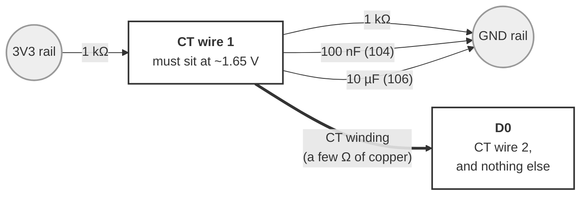
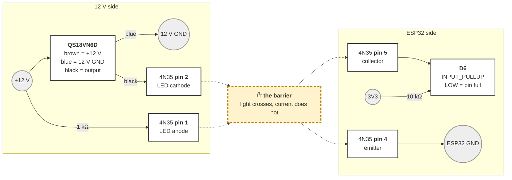
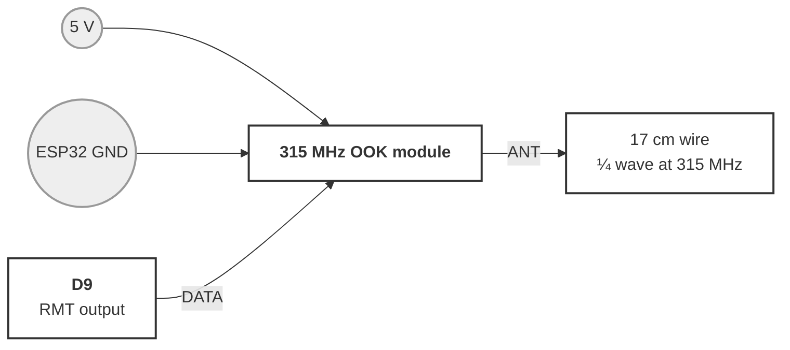
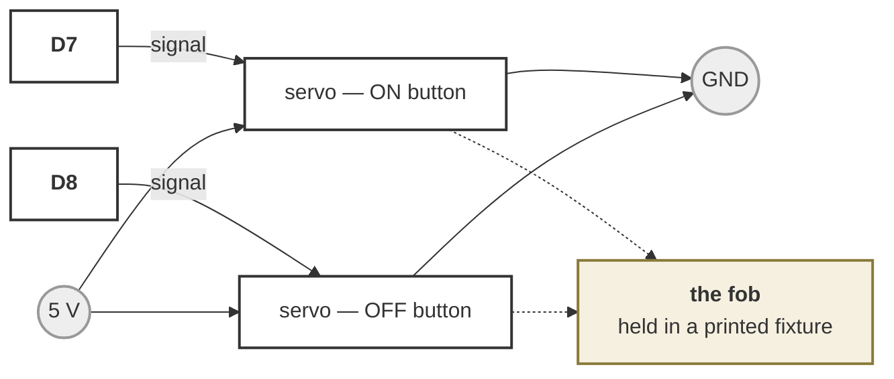

# Wiring Reference — DustGate

**Everything that gets soldered, in one file.** There were seven — a shop-wide
reference plus a file per board personality and one per bench rig — and the split
made sense while a gate board, a collector board and a slider board had three
different pin maps. They have had ONE since 2026-09-17 (`boards/xiao_c5.h`), so
the files were describing the same pads three times and had begun to disagree:
the bin sensor was documented twice with different opto parts, the status screen
twice, the CT divider twice, and the power section three times.

Merged 2026-09-17. Nothing that was true was dropped; what went is listed at the
bottom under "What was removed in the merge", so a missing paragraph can be found
in `git log` rather than re-derived.

**The authoritative pin numbers are the board header,
[`firmware/boards/xiao_c5.h`](boards/xiao_c5.h)** — the build reads that, and a
wiring doc that disagrees with it is the wiring doc being wrong.

**All GPIO is 3.3V logic.** Do not connect 5V signals directly to an ESP32 pin.

---

## Contents

| | |
|---|---|
| [1. The board, and its one pin map](#1-the-board-and-its-one-pin-map) | which pad does what, on every build |
| [2. Power](#2-power) | supplies, rails, and what browns out |
| [3. Decoupling](#3-decoupling) | keeping the ESP32 out of brownout |
| [4. Status pixel](#4-status-pixel) | the one indicator, and what its colours mean |
| [5. Status screen and wake button](#5-status-screen-and-wake-button) | SSD1306 on D4/D5, button on D1 |
| [6. Servos](#6-servos) | the PWM block: one gate, two fob arms |
| [7. The slider — ST3215 bus and endstops](#7-the-slider--st3215-bus-and-endstops) | the other personality |
| [8. CT clamp](#8-ct-clamp) | the divider, and the measurement it makes |
| [9. Bin sensor](#9-bin-sensor) | Banner QS18VN6D through a discrete 4N35 |
| [10. 315 MHz transmitter](#10-315-mhz-transmitter) | keying the collector's own remote |
| [11. Fob servos](#11-fob-servos) | pressing that remote mechanically instead |
| [12. Smart outlets](#12-smart-outlets) | what the brain talks to over WiFi |
| [13. Reading the markings](#13-reading-the-markings) | resistor bands and cap codes |
| [14. If it looks dead](#14-if-it-looks-dead) | the first things to check |
| [15. What is still unverified](#15-what-is-still-unverified) | read before trusting any of it |

---

## 1. The board, and its one pin map

ONE BOARD: the **Seeed XIAO ESP32C5**, primary or node depending only on which
program you flash it with, and gate board or collector board depending only on
what the LAYOUT points at it. There is no third thing to wire.

#### Top view — the labels you can't see once it's docked

The silkscreen is on the **bottom** of the board, so every pad label disappears
the moment it's in a socket. This is that label, from above. **The USB-C
connector is the only orientation reference** — the board is otherwise
symmetrical, and it is easy to count a servo lead onto the wrong row.

```
                                           USB-C
                                         ┌───────┐
                             ┌─────┬─────┴───────┴─────┬─────┐
     analog in ── D0  GPIO1  │  o  │                   │  o  │  5V          ←  do NOT power servos from this pad
   wake button ── D1  GPIO0  │  o  │                   │  o  │  GND         ←  servo / pixel / screen ground
  status pixel ── D2  GPIO25 │  o  │       XIAO        │  o  │  3V3         ←  screen VCC  (never 5V)
          free ── D3  GPIO7  │  o  │      ESP32C5      │  o  │  D10  GPIO10 ── servo ch 4
    screen SDA ── D4  GPIO23 │  o  │                   │  o  │  D9   GPIO9  ── servo ch 3
    screen SCL ── D5  GPIO24 │  o  │    (top view)     │  o  │  D8   GPIO8  ── servo ch 2
ST3215 TX rsvd ── D6  GPIO11 │  o  │                   │  o  │  D7   GPIO12 ── servo ch 1  /  ST3215 RX rsvd
                             └─────┴───────────────────┴─────┘
```

**Every function is on the side its pad is on** (changed 2026-08-22, for PCB
work): left-column pads carry their label to the left, right-column pads to the
right, so a row reads straight across from net to pin without a callout arrow
crossing the board. `rsvd` marks a pad the firmware does not use today but that
`boards/xiao_c5.h` names in a commented-out block — do not spend it on the
carrier.

The screen and its button are one fitting: the board header defines all three pads
at once, so D1, D4 and D5 are spoken for on every C5 build whether or not a panel
is plugged in. What's left is D0 and D3, plus D6/D7 until the ST3215 arrives.

**D8 and D9 used to carry a ⚠ here and no longer do.** It marked a suspected
strapping-pin problem — an NC endstop or an idling servo signal holding a strap
LOW through reset. GPIO8/GPIO9 are ordinary IO on the C5 (the straps are
26/27/28) and this was closed on the bench 2026-08-19, so the mark was stale and
would have cost a PCB revision to work around nothing.

Counting rule when it's docked and you can see nothing: **hold the USB-C end
away from you.** Left column is D0→D6 running away from the connector; right
column is 5V, GND, 3V3, then D10→D7 running toward you. Servo channel 1 is the
pad in the corner *diagonally opposite* the USB-C connector.

The two buttons are at the USB-C end: **RESET** reboots, **BOOT** does nothing on
its own. Download mode is hold BOOT → tap RESET → release BOOT. Pressing BOOT
alone on a hung board gets you nothing, which is easy to mistake for a dead board.

> **Which of these pads has actually passed a signal** — the distinction that
> matters if you are about to commit them to copper. Everything here started as
> Seeed's published pinout redrawn, not a board traced with a multimeter; some of
> it has since been confirmed by hardware doing something.
>
> | Confirmed by a working signal | Still drawing-only |
> |---|---|
> | D7, D8, D9, D10 — servos moved (2026-08-21) | D0, D3 — never connected to anything |
> | D4, D5 — panel answered at 0x3C (2026-08-22) | |
> | D1 — button press lit the screen (2026-08-22) | D6 — reserved for the ST3215 bus, nothing on the bench to talk to |
> | D2 — a WS2812 lit and showed the right colours (2026-08-23) | |
>
> **Every pad this firmware actually uses is now confirmed by a working signal.**
> The servo block, the I²C pair, the button and the pixel are all as good as
> traced. What is left in the right-hand column is pads nothing has ever been
> attached to — a wrong number there costs a board spin, but no test can find it
> until something is wired to them.
>
> The physical *positions* of the pads on the edge are still Seeed's drawing
> throughout. The header [`boards/xiao_c5.h`](../boards/xiao_c5.h) is what the
> build reads; if it and this file disagree, the header is right.

#### The numbers

XIAO silkscreen pads D0–D10 map to GPIO **1, 0, 25, 7, 23, 24, 11, 12, 8, 9, 10**
— confirmed 2026-08-16 against Seeed's pin-definition drawing, so this row is no
longer hearsay.

**Every pad, in silkscreen order** — the carrier has to account for all of them,
including the ones nothing uses, so this is the list to lay out from rather than
the signals-only version it replaced (2026-08-22). "Passive" is what the carrier
owes the net; where it says none, none is needed.

| Pad | GPIO | Net | Passive the carrier owes it | Notes |
|-----|------|-----|------------------------------|-------|
| D0  | 1    | *free* | — | **The only ADC pad on the edge.** Keep it free for a current sense; don't spend it on a digital function that fits elsewhere |
| D1  | 0    | Wake button | none — internal pull-up | Momentary NO to GND, `INPUT_PULLUP`. Not a strap on the C5, so safe held down through reset. Verified 2026-08-22 |
| D2  | 25   | Status pixel DIN | **330 Ω series** | External WS2812; the onboard LED is plain yellow. See §3 |
| D3  | 7    | *free, but* | — | ⚠️ **GPIO7 is a strapping pin** (JTAG source). Fine as an output or as an input that idles HIGH; never for one that can be held LOW through reset. See §6 |
| D4  | 23   | Screen SDA | none (module carries its own pull-ups) | XIAO-standard I²C. Verified 2026-08-22. If a bare panel with no pull-ups is ever used, 4.7 kΩ (`yellow violet red gold`) to 3V3 |
| D5  | 24   | Screen SCL | none (as SDA) | ditto |
| D6  | 11   | **Bin sensor in** (PWM builds) / ST3215 bus TX (slider builds) | **1 kΩ series** on the bus when fitted; none for the bin sensor | One pad, two mutually exclusive jobs — `config.h` `#error`s if a build claims both. Bin sensor: §7. Bus: hardware UART TX, half-duplex, see §2 |
| D7  | 12   | Servo ch 1 — **and** ST3215 bus RX | none | The one genuinely contended pad: a serial-bus build gives up PWM channel 1 |
| D8  | 8    | Servo ch 2 | none | Ordinary GPIO, not strapping (bench-confirmed 2026-08-19). Alt: SDIO_DATA0 |
| D9  | 9    | Servo ch 3 | none | Ordinary GPIO, not strapping (same). Alt: SDIO_CLK |
| D10 | 10   | Servo ch 4 | none | Alt: SDIO_CMD |
| 5V  | —    | Carrier 5 V in | **Schottky in series** | Bidirectional VBUS. Without the diode, carrier power and a plugged-in USB cable short two supplies together |
| GND | —    | Common ground | — | Servo, pixel and screen grounds all common here. Mandatory, not optional |
| 3V3 | —    | Screen VCC | — | Regulator output. **Never feed the screen 5 V**; never draw servos from it |
| —   | 27   | Onboard user LED | — | Not on the edge. Green, single colour, strapping but latched at reset (§6). Fallback only — see §3 |

**Servos are not powered from this board.** Every servo V+ comes off the buck
directly, with the bulk and bypass caps at the servo terminals (§2) — the pads
above carry signal and ground only. The most expensive mistake available on this
carrier is running four servos' current through the XIAO's 5V pad.

**Absent from the PWM build, present in the slider build.** `config.h` derives
`HAS_LINEAR` from whether the board header defines `PIN_SERVO_BUS_TX` — not from
`PIN_TMC_STEP`, which is what this note used to say and stopped being true when
the stepper went to the attic on 2026-08-23. So the same header presents two pin
maps and `-DDUSTGATE_SERVO_BUS` chooses:

- **without it** (`xiao_c5_primary`, `xiao_c5`): four PWM pads, no bus, no
  endstops, `HAS_LINEAR` 0. The driver, the feedback system and the endstop
  supervisor all compile out.
- **with it** (`xiao_c5_linear_primary`, `xiao_c5_linear`, `xiao_c5_bus_bench`):
  the bus on D6/D7 and the endstops on D8/D9, `HAS_LINEAR` 1, no PWM block at
  all.

Defining both "to keep the interface uniform" is not merely untidy — `config.h`
`#error`s on it. PWM and serial never share a board.

---

---

## 2. Power

| Rail            | Source                    | Notes                                     |
|-----------------|---------------------------|-------------------------------------------|
| Motor 12–24V    | Separate DC supply, ≥2A   | Connect to TMC2209 + and − terminals      |
| ESP32 5V        | USB, or 5V/VIN header pin  | Onboard AMS1117 regulates it to 3.3V      |
| ESP32 3V3       | Regulated output pin      | Powers GPIO logic + TMC2209 VDD           |
| Common GND      | Shared across all rails   | Connect ESP32 GND to motor supply GND     |

Do **not** power the motor from the ESP32 3.3V or USB 5V rail.
Always common the grounds.

#### USB-PD instead of a DC brick — the intended supply

The barrel-jack brick above is the legacy arrangement. The direction is **USB-PD
for everything**: one USB-C charger, a PD trigger to negotiate the voltage, and a
buck to whatever the actuators want. A charger is a part people already own and can
replace anywhere, which a 15V 3A barrel brick is not.

**Pick the PD voltage from the spec's fixed list, not from what your charger
happens to offer.** USB-PD's normative fixed voltages are **5V, 9V, 15V and 20V**.
**12V is optional** — common, but not guaranteed, so a design that needs 12V is a
design that fails on some perfectly good chargers. This is the reason to prefer a
9V or 15V part over a 12V one when the choice is open.

##### Bench-validated chain (2026-08-12)

Measured on the bench, not derived: a primary with the status pixel and one 6kg
digital servo, through a deliberate stall, showed **no brownout and no reset —
with no capacitors fitted at all.**

```
USB-C charger ──> HUSB238 (PD trigger, 15V) ──> MPM3610 buck ──> 5V ──┬── board 5V/VIN
                                                                      └── servo V+
```

Read that result carefully before copying it:

- The **MPM3610 breakout is rated 1.2A**, where [architecture-rfc.md](../docs/architecture-rfc.md)
  specs an **XL4015 at 5A** for this job. A stalling 6kg digital servo can ask for
  1.5–2.5A — above the buck's limit. So "no brownout at stall" may be the buck
  **current-limiting** rather than the servo being satisfied. Both look identical
  from outside. It is a real data point about the ESP32 surviving, not proof the
  supply has headroom.
- It held with **one** servo. The design is **four per node**. What makes that
  plausible on a small buck is that `holdAtRest` defaults **false** (servos move
  then detach, so idle channels draw nothing) and only one servo is ever commanded
  at a time — see the mutex note in [§3](#3-decoupling). Both have to stay true for the budget to.
- **Fit the capacitors anyway** ([§3](#3-decoupling)). A stall transient is microseconds to
  milliseconds; you will not see it without a scope, and the first symptom is a
  reboot mid-move rather than anything legible in a log. Not having hit it is not
  evidence against it.

##### Two 5V sources at once

Bench work usually means the buck's 5V **and** the host's USB VBUS are on the board
together. Unless something isolates them, the buck feeds the host's USB port.

Check it with one measurement: **unplug the host, leave the buck running, measure
VBUS on the USB connector. It should read 0V.** Anything near 5V is backfeed into
your computer. A Schottky between the buck and the board's 5V pin is the usual fix —
put anything else on the board side of it so the diode isolates the supply, not the
peripheral.

> **Hypothesis, not a diagnosis.** A peripheral on 5V with its signal line tied to a
> 3.3V GPIO *can* push current through the ESP32's ESD clamp diodes into the chip's
> own 3V3 rail, and a partially-powered ESP32 cannot latch its strapping pins
> cleanly on reset. That is a real and well-known mechanism, and it is the reason
> the series resistors in [§4](#4-status-pixel) are a current limit rather than decoration.
>
> It has **not** been shown to be what happened here. What was actually observed on
> 2026-08-12: flashing failed with `Wrong boot mode detected (0x13)` while the
> board was seated on its carrier and succeeded with the board off it; the
> carrier's NeoPixel was later found installed **backwards**; the carrier was then
> dismantled before anything was isolated. A reversed WS2812 is its own fault with
> its own conduction path, and no measurement tied either one to the strapping
> failure. Treat this section as a thing to check, not a thing to conclude — see
> the open item in TODO.md.

##### Planned: the serial-bus slider

The ST3215 replaces the stepper, on **its own board riding with the slider** — it
never shares a board with PWM servos. Power is local at the gate (12V barrel, its
rated voltage for 30 kg·cm), which is what keeps the TTL bus short. Note PD is not
a shortcut here: the XIAO's USB-C is a device port and won't negotiate, so a PD
umbilical still needs a trigger module at the sled. Not built yet.

---

---

### At the collector specifically

**THERE IS A CHOICE HERE AND §2 ASSUMED ONE WITHOUT SAYING SO.** Corrected
2026-09-11, when Jeff asked how the 12 V ground ties to a 12→5 V regulator. The
answer is that it does, straight through — **a plain buck converter shares its
input and output ground by definition** — so on a single-supply build the two
grounds are already common upstream and §2's barrier is bypassed before the
optocoupler ever sees it.

Three topologies. Pick one deliberately.

| | Supplies | Grounds | What the opto is doing |
|---|---|---|---|
| **A. Two bricks** | 12 V for the sensor, USB for the board | **separate** | Isolating, as §2 describes |
| **B. One 12 V + plain buck** | one 12 V, buck to 5 V | **common, through the buck** | **Level shifting only** |
| **C. One 12 V + isolated DC-DC** | one 12 V, isolated 12→5 module | separate | Isolating, on one supply |

**DECIDED: A FIRST (Jeff, 2026-09-11), then B once it works.**

Not because A is better — it is the worse install, two bricks and two outlets
at a machine that already has a cord and a remote and a duct. Because it is the
**baseline**, and this board has too many unknowns to add an avoidable one.

The reasoning is worth keeping, because the first version of this note had it
backwards. It said "build B, upgrade if the CT fails" — which sounds thrifty and
is bad diagnosis: **a noisy CT on B tells you nothing**, because you cannot tell
a shared-ground problem from the screen's charge pump, from the divider, from
the clamp, or from the motor itself. §3 already has three unvalidated changes in
it. Adding a shared ground underneath them means a failure has four candidate
causes and no reference to compare against.

A removes one variable for the price of a second power brick. Then **B becomes a
measurable change** rather than a guess: same board, same clamp, same firmware,
one thing different, and a known-good reading to compare to. If B matches A, the
install gets simpler for free. If it does not, that IS the answer about shared
grounds, and C is the fix that keeps one brick.

**B is still the better install**, which is why it is what to aim at. One brick
at the collector,
one cord, one thing to plug in — against A's two bricks and two outlets, at a
machine that already has a cord and a remote and a duct. Do not pick A for
isolation you then throw away with a shared chassis or a common earth anyway.

**On B the optocoupler still earns its place**, and this is the part worth being
clear about, because "the isolation is gone" reads as "the part is pointless".
It is not. The QS18's output swings to **12 V**, and 12 V on a 3.3 V GPIO
destroys it. The opto translates that to a 3.3 V-referenced signal and keeps the
pin behind a barrier from a wire that runs across a shop. Two jobs; B keeps one.

If you build B, **§2's warning does not apply** — there is no barrier left to
short — and the rest of §2 stands unchanged, because the opto is wired the same
either way.

**C is the one to choose if the noise turns out to matter.** The reason to care
is in §3: a CT clamp, feet from an induction motor, on a board whose ADC noise
floor is unresolved. If the CT proves unusable on a shared ground, an isolated
DC-DC is the fix that keeps the single-brick install.

##### If you build C: which part, and the budget that decides it

"Isolating buck" is a contradiction — a buck is non-isolated by definition, one
inductor and a shared return. The parts are flybacks, sold as **isolated DC-DC
converters**.

| | | |
|---|---|---|
| **No fob servos** | [Traco **TMR 3-1211**](https://www.tme.com/us/en-us/details/tmr3-1211/dc-dc-converters/traco-power/tmr-3-1211/) | 9–18 V in, 5 V / **600 mA**, 3 W, regulated, SIP8 |
| **With fob servos** | [Traco **TMR 6-1211**](https://www.tracopower.com/model/tmr-6-1211) | same, 5 V / **1.2 A**, 6 W |

Mornsun's URB1205S series is the cheaper equivalent of either.

**Buy REGULATED.** The 1–2 W unregulated parts (`B1205S-1W` and friends) are
cheap and wrong here: their output sags with load, which is exactly the failure
mode a lumpy load produces.

**The budget, and the two corrections that got it here.** Base load is about
400 mA peak — ESP32-C5 ~250–300 mA on WiFi TX, OLED ~20 mA, pixel up to 60 mA,
transmitter ~30 mA while keying. Then:

- **Only one fob servo is ever moving.** Pressing ON and OFF at the same moment
  is meaningless, so a two-button fob still budgets for ONE servo. (The first
  version of this note doubled it.)
- **A button press is not a stall.** A gate valve loads a servo continuously; a
  fob button is a short travel against a light spring, and `ServoActuator` does
  move-then-detach, so nothing holds torque afterwards. A **9 g servo** (SG90
  class — which is all a button needs, not the metal-gear kind the gates use)
  draws a couple of hundred mA doing that, against ~650 mA if it jams.

So ~400 mA base plus one small servo lands comfortably inside 1.2 A and
uncomfortably against 600 mA. **TMR 6-1211 for any build with a fob servo**,
TMR 3-1211 only for RF-only.

**Bulk capacitance does NOT substitute for headroom.** Holding 1 A for 200 ms
within half a volt needs about 0.4 F. Size the converter.

**And you cannot split the rails.** Feeding the servos from a separate
non-isolated buck off the same 12 V looks like a cheap way out and is not: a
servo's ground must be common with whatever drives its signal pin, and that is
the ESP32 on the isolated side. Splitting puts the servo signal across the
barrier with no shared return.

**Check it on arrival, in one second:** meter on continuity between input GND
and output GND. **An isolated module reads open; a plain buck reads ~0 Ω.** Do
not trust the label — that measurement is the whole claim.

| Rail | Feeds | From |
|---|---|---|
| 5 V | the board, the transmitter, the servos | USB brick (A) or a buck off 12 V (B/C) |
| 3V3 | the CT divider, the opto's output side | the board's regulator |
| 12 V | the QS18 beam sensor, lamps | the 12 V supply |

**Never join 12 V to 5 V or 3V3.** That is true in all three, and is a different
claim from the ground question — the RAILS never meet, whatever the grounds do.

**Nothing has been built**, so none of this is a result yet. Build A, get a CT
reading that separates a running blower from a quiet one, and only then try B —
with A's numbers in hand to compare against. See §3 and §7.

**Servos and a transmitter share the 5 V rail, and both are lumpy loads.** A
servo stalls at an amp or more and an OOK module keys hard. Neither has been
measured together on one brick. If the transmitter becomes unreliable *while a
servo moves*, that is the first thing to suspect — and the two are never needed
at the same instant, so staggering them in firmware is available before adding
hardware.

---

---

## 3. Decoupling

> **Untested on hardware.** This is standard practice written down so the bench
> session starts from a known-good arrangement, not a measured result. (It used
> to cite a 100µF at the stepper's VMOT as the one measured value; that document
> went with the stepper on 2026-08-28.)

The WROOM-32's brownout detector resets the chip when 3V3 sags past **~2.8V**.
Nothing on the ESP32 side causes that. The loads sharing the rail do:

- **Servo inrush and stall** — a hobby servo pulls 0.5–1A+ for tens of milliseconds
  when it starts moving and when the gate hits its stop. On the v2 servo nodes this
  is the main offender. **Budget for ONE moving servo, not two:** the firmware holds
  a hard mutex — only one servo is ever commanded at a time — and the move queue is
  shop-wide and serial, so even a make-before-break transition across two systems
  concatenates its moves rather than overlapping them. (Corrected 2026-08-12; this
  previously said two could move at once, which doubled the budget for no reason.
  The invariant is in [architecture-rfc.md](../docs/architecture-rfc.md).)
- **Idle servos draw nothing.** `holdAtRest` defaults false — a servo moves, then
  detaches, and the valve holds by friction. So a four-gate node's steady draw is
  the ESP32 alone. Set `holdAtRest` true on a build that back-drives when
  de-energized and that stops being true, which changes the supply sizing.
- **Stepper coil energizing** — the TMC2209 slams current into the coils on enable
  and on the first steps after idle.
- **Long thin wire** — ~0.3Ω in 10ft of 22AWG turns a 1A transient into a 0.3V drop
  before any capacitor gets to see it.

Capacitors absorb the fast transient. They do **not** fix an undersized supply or a
wire run that's too thin, and reaching for more capacitance is the wrong move when
the rail is sagging steadily rather than dipping.

#### What to fit

| Location                       | Value          | Type                    |
|--------------------------------|----------------|-------------------------|
| TMC2209 VMOT ↔ GND             | 100–220µF      | electrolytic            |
| Servo power rail, per node     | 470–1000µF     | low-ESR electrolytic    |
| ESP32 VIN/5V ↔ GND             | 100–220µF      | electrolytic            |
| ESP32 3V3 ↔ GND                | 10µF + 0.1µF   | ceramic (X5R/X7R)       |

Rate every electrolytic at **≥2× its rail** (so ≥50V on a 24V motor supply), and put
a 0.1µF ceramic in parallel with each one: the electrolytic carries the bulk energy,
the ceramic handles the fast edge its ESR can't.

#### Where they go

Directly across + and − **at the load**, on the shortest leads you can manage. A bulk
cap back at the power supply does almost nothing — the wire inductance between it and
the servo is the thing you're compensating for.

```
Servo node — the one that matters:

  5V/6V supply ──┬────────────┬───── servo V+   (red)
                 │            │
            [470-1000µF]   [0.1µF]      <-- AT the servo terminals,
                 │            │              not back at the supply
  GND ───────────┴────────────┴───── servo GND (brown/black)

  GPIO25/26/27/14 ─────────────────── servo signal (orange/yellow)
  ESP32 GND ───────────────────────── common with servo GND   (REQUIRED)
```

```
ESP32 board input:

  5V buck out ──┬──────────┬───── VIN (5V pin)
                │          │
            [100µF]     [0.1µF]
                │          │
  GND ──────────┴──────────┴───── GND

  and close to the 3V3 pin:

  3V3 ──┬──────────┬── GND
     [10µF]     [0.1µF]
```

Electrolytics are polarized — stripe/short leg to GND. Backwards on a 12V rail they
vent.

#### The four rules that matter more than the caps

1. **Don't power servos from the board's 5V pin.** That routes servo current through
   the board's traces and its USB/regulator path, which is the fastest way to brown
   out. Feed servos from the buck converter directly; the ESP32 gets its own leg off
   the same buck.
2. **Star ground.** Servo GND, TMC2209 GND and ESP32 GND each return to one point at
   the supply. Daisy-chaining them puts the stepper's return current across the
   ESP32's ground reference.
3. **Fat wire on the power legs** — 18–20AWG for servo and motor power, short runs to
   the node. 22AWG and up is fine for signal.
4. **Common ground is mandatory** — for every servo, and for the ST3215 bus
   above all: a single-ended TTL line has no other reference, and the usual
   symptom of a missing ground is a bus scan that finds nothing at any baud
   (`WIRING.md#7-the-slider--st3215-bus-and-endstops` §1). Without it, PWM signals have no reference
   either.

#### If it still browns out

Put a scope (or a fast multimeter) on the 3V3 pin during a gate move before adding
capacitance:

- **Dips for ~10ms, then recovers** — transient. More/closer bulk capacitance helps.
- **Sags and stays down** — the supply is undersized or the run is too long. Size the
  buck for *stall* current × the number of servos that can move together, not rated
  current, and shorten or thicken the run.

---

---

## 4. Status pixel

Every board runs the same indicator now, primary and secondary alike
(`firmware/utils/StatusLed.h`). It is a **single WS2812-family pixel**, not a
plain LED: one data line either way, but a colour is readable across a dusty shop
in one glance where a blink rate is not.

| Colour | Meaning |
|--------|---------|
| **Green** | Ready. Node: primary linked. Primary: routing live **and every paired board answering**. |
| **Blue** | On WiFi but not ready. Node: no primary linked. Primary: no layout stored yet, or a board it's paired with is dark. |
| **Orange, solid** | Something is moving. Solid = a move or servo sweep, slow blink = homing, fast blink = calibration sweep. Also a 400 ms flash when a command lands. |
| **Orange, blinking (~1.5×/sec)** | WiFi lost, or never joined. Shares the colour with "moving" — the rate is what tells them apart, so check whether it is steady before assuming a gate is in flight. |
| **White, blinking** | Captive portal is up, waiting for WiFi credentials. The only state that needs a human to walk over — hence the only white. |
| **Red, pulsing** | Fault. Hardware init failed or the system is in e-stop. |

Orange outranks everything except nothing-happening, deliberately: "is anything
actually moving?" is the first question every time a gate misbehaves.

#### Wiring it

The XIAO C5 drives an **external** pixel on GPIO25 (D2) — its onboard LED is
plain yellow, not RGB, so this is a part you add.

```
5V  ──────────────┬──── Pixel VDD
                  │
               [1000µF]        (across VDD/GND, close to the pixel)
                  │
GND ──────────────┴──── Pixel GND ──── ESP32 GND   (common ground, mandatory)

GPIO25 ──── [330R] ──── Pixel DIN
```

The 330Ω series resistor and the bulk capacitor are the two things people skip
and then chase: the resistor protects DIN against the inrush on a hot-plug, and
the cap keeps the pixel's own switching off a rail shared with servos.

**On 3V3 vs 5V logic.** The ESP32 drives 3.3V, and a WS2812 running off 5V wants
a DIN above ~0.7×VDD = 3.5V. In practice a single pixel usually latches fine at
3.3V, and this is the common hobby shortcut — but it is out of spec and shows up
as an intermittent wrong colour, not a clean failure. Two reliable fixes:

- **Run the pixel from 3V3 instead of 5V.** One status pixel draws little enough
  that the regulator won't notice, and 3.3V logic into a 3.3V pixel is in spec.
  This is the recommended option here.
- Or keep 5V and add a level shifter on DIN.

Use a **WS2812B-family** pixel (Adafruit NeoPixel breakouts, or a single pixel cut
from a strip). The firmware drives it with the Arduino core's own RMT-based
routine, so there is no library to add.

**On a servo build, mind the shared 5V rail.** If you power the pixel from the
same supply as the servos, a servo's inrush can brown the pixel into a garbage
colour — which then reads as a fault that isn't one. The bulk cap above helps;
powering the pixel from 3V3 sidesteps it entirely.

---

---

## 5. Status screen and wake button

> **WORKING**, on a C5's D4/D5 at 0x3C. Not verified: the sleep/wake behaviour
> over hours, or whether every layout reads well on real glass.
>
> **Check for a swapped pair first** — SDA and SCL reversed scan exactly like a
> dead module, which is what it took to get there the first time.

A 0.96" 128×64 SSD1306 on I²C, so *"is it connected?"* has an answer you can read
at the machine instead of on a phone. The layouts — what each screen says, and
the eight-row budget they have to say it in — are in
[`docs/mockups/oled-status.html`](../docs/mockups/oled-status.html); this chapter
is only the wire.

#### It never replaces the pixel

The pixel is readable across a dusty shop; the screen is readable at arm's
length. That is the whole division of labour. §1 stays fitted on every board,
and the screen — where one is fitted at all — mirrors the *same*
`statusled::Status` state the pixel is showing rather than inventing a second
vocabulary. Two indicators that could disagree with each other would be worse
than one.

#### Wiring

Four wires, and no level shifting: run the module from **3V3**, and its I²C lines
are then already at the ESP32's logic level.

```
3V3 ─────────────── VCC
GND ─────────────── GND   ── common with the board's ground
SDA pin ─────────── SDA
SCL pin ─────────── SCL
```

On the [XIAO C5](WIRING.md#1-the-board-and-its-one-pin-map) that is **GPIO23 / GPIO24 (D4/D5)** — the
XIAO-standard I²C position, so Seeed's own accessories land on it, and free in
either role.

**Do not run it from 5V.** These modules will take it, but then their SDA/SCL
idle at 5V through the onboard pull-ups, and no ESP32 here is 5V tolerant. The
3V3 rail has ample headroom for it — the panel draws under 20mA with every pixel
lit, and far less showing text.

**Address is 0x3C** on essentially all of the 4-pin 0.96" modules (0x3D exists on
some 128×64 parts; if it scans up as 0x3D, that is why). No pull-up resistors to
add — the modules carry their own.

#### Finding out whether it is wired right

`i2c` on the serial console scans the bus and says what answered, at what
address, and what it probably is:

```
i2c              # scans the pins this build declares for the screen
i2c 16 4         # scans a pair you name — the useful form when hunting
```

It separates the three failures that look identical from outside: nothing
powered, wrong address (0x3D rather than 0x3C), and SDA/SCL swapped. It also
names a **PCF8574 character-LCD backpack** (0x27/0x3F) if that is what is on the
bus, because that is a different part this firmware cannot drive at all — not a
setting to change.

Scans at 100kHz rather than the screen's 400kHz: a marginal pull-up or a long
dupont run fails at 400k and answers fine at 100k, and "the module is alive" is
the thing you need first.

#### Burn-in, and why the screen sleeps

An OLED with fixed labels lit 24/7 burns them in — the ghost of `gates` and
`nodes` etched across every later screen. So the intended behaviour is:

- **Blank after a couple of minutes idle, always.**
- **Wake on events** — a gate moving, a tool drawing power, a node dropping, any
  fault.
- **Blank on demand too** (2026-08-22) — a second press of the wake button puts
  the panel out early. It does not latch: the next event still lights it.
- **Nothing holds it awake** (changed 2026-08-22). A fault used to, on the
  reasoning that nobody should have to press anything to find out what broke.
  But a fault is exactly the state that *lasts*: a node goes dark on a Friday
  and the panel spends the weekend burning "NODE DARK" into itself with nobody
  in the shop. The alarm still lights the screen when it happens — it just
  doesn't hold it. Anyone arriving later presses the button.

Which makes a lit screen mean *something happened*, instead of becoming wallpaper
you stop reading. That is a firmware behaviour, not a wiring one, but it is the
reason the wake button below is a **requirement** on any board with a panel and
not the convenience it started as.

That policy is `statusscreen::awake()` in
[`utils/StatusScreenModel.h`](utils/StatusScreenModel.h), and it is a decision
rather than a comment — the captive portal blanks along with everything else, so
a stranger being asked to join an AP may have to press the button too.

#### The wake button

Since the timer has no exceptions, the button is the **only** way to see a state
the screen has already slept through — a fault raised on Friday, a portal waiting
on Saturday, or just a healthy board you want to read from two feet away.

**It toggles** (2026-08-22): press to light the panel, press again to put it out
instead of standing in front of a finished reading for the two minutes the timer
takes. The timer still has the last word, and a manual blank doesn't suppress
anything — the next real event lights the glass exactly as it would have. The
short press fires on RELEASE, because of the hold below.

**Hold it for a second and it sweeps every servo** (2026-08-22) — channel 1 to 4,
out and back, one at a time, with the channel and commanded angle on the panel.
A bench instrument for a failure with no other symptom: a servo that answers once
per boot and then silently stops (see `ServoActuator::_deenergize()`). It drives
the servo driver directly, so a board with no shop stored and no gates allocated
runs it exactly the same. **It refuses while the collector is running** and says
so on the panel — sweeping the gates shut against a pulling collector is a
dead-head, and a button can't ask "are you sure". Driver:
[`motor/ServoSelfTest.h`](motor/ServoSelfTest.h).

Ordinary momentary switch to GND, read with `INPUT_PULLUP`:

```
GPIO ──── [momentary NO] ──── GND
```

Same NC-vs-NO caution as the endstops in reverse: this one is **normally OPEN**,
so the pin idles HIGH and a strapping pin is harmless here — nothing holds the
line at reset unless someone is pressing the button while the board boots.

**It is fitted with the screen, not separately, and enforced.** A board header
defines `PIN_WAKE_BTN` alongside the I²C pair, because a board with nowhere to
put a panel has nothing for a button to wake — and `WakeButton.h` fails the build
with an `#error` on the reverse case. On the XIAO C5 it is GPIO0 (D1), internal
pull-up.

The driver is [`utils/WakeButton.h`](utils/WakeButton.h): a debounced poll, a
short press that calls `statusscreen::toggle()`, and a one-second hold that calls
`servoselftest::start()`. **Two gestures, and no more** — no double-tap, no menu,
no paging. The self-test earned the second one by being the only instrument for
an invisible failure, and it stays a bench tool rather than shop control: raw
channels, and a refusal instead of a prompt. Anything that changed what the shop
*does* in service would still need every confirmation the web UI has, and that is
a different part with a different name.

> **Verified on a XIAO C5** — a press lights the panel. The **toggle is newer
> than the test**: press-again-to-blank has never been pressed.

#### Fitting one is a build-time fact

A DustGate ships without a screen unless somebody fits one, so the display has to
compile out completely when its pins aren't defined — the same seam `HAS_LINEAR`
and `PIN_PIXEL` already use. No display, no library, no flash spent. That guard
sits on the *driver*: the layout model is pure C++ that touches no pin, so a
board with no screen pays only what the linker drops.

There is no screen-vs-no-screen env — every build carries the driver (21.6 KB of
flash, 296 bytes of RAM) and the 0x3C probe decides. Don't reintroduce one: the
flag's only remaining effect was letting a flash without the right env suffix
produce a board whose screen and button had compiled to nothing, silently.

A board with the pins and *no panel on them* is now the ordinary case rather than
a mistake: `StatusScreen::begin()` does a zero-length write at 0x3C first, and an
ACK is the whole test. No ACK → it says so on serial and disables every later
call, so a missing panel cannot hang the brain in Wire's timeout once per pass of
`loop()`.

**That probe is ours, and it has to be.** `Adafruit_SSD1306::begin()` does not
check anything — read it: the only `return false` is a failed `malloc` of the
1 KB framebuffer. It clocks the init sequence into open air and reports success
regardless. Trusting it printed `SSD1306 up` on a board with an empty bus
(2026-08-21), which is a worse failure than no message at all.

**And pass `periphBegin = false`.** Left at its default the library calls
`wire->begin()` with no arguments, which on an ESP32 re-initialises I²C on the
core default pins — **GPIO21/22** — rather than the ones the board header names.
The panel then talks to nothing while two unrelated pins get driven as a bus.

The two Adafruit libraries (SSD1306 + GFX) are why that env is separate rather
than a flag on the default one. A board with no panel should not download,
compile or store a display driver — the screen env costs ~32 KB of flash over
a servo-only build, which is exactly what an unfitted board declines to pay.

---

## 6. Servos

D7–D10 are four **adjacent pads on one edge**, chosen so a servo loom can be
built once and moved between boards. Channel order matches
[`boards/qtpy_s3.h`](../boards/qtpy_s3.h)
— channel 1 is the first pad of the block — so a topology's `servo.channel`
means the same gate on any node.

```
  5V/6V supply ──┬────────────┬───── servo V+   (red)
                 │            │
            [470-1000µF]   [0.1µF]      <-- AT the servo terminals
                 │            │
  GND ───────────┴────────────┴───── servo GND (brown/black)

  D7/D8/D9/D10 ──────────────────────  servo signal (orange/yellow)
  (GPIO12/8/9/10)                       one pad per channel, ch1 = D7
  XIAO GND ──────────────────────────  common with servo GND   (REQUIRED)
```

**Never power servos from the XIAO's 5V pad.** Same rule as every other board
here, and it matters more on a part this small: feed servos from the buck
directly, and give the board its own leg off the same buck. See
[§3](#3-decoupling).

#### The serial-servo bus, and the endstops that come with it

> **A servo answered on these pads 2026-08-26**, stepped three full turns on
> 2026-08-28, and **drove a real 4-gate rack the same day**: homed to its datum,
> ran the reference sweep, and moved to every gate. The endstops below are proven
> on that rail too. What has NOT run is the same actuator as a NodeLink *node*.

D6/D7 (GPIO11/GPIO12) are the hardware UART. **D7 doubles as servo channel 1**,
so a build driving a serial-bus servo gives up PWM channel 1 — the right trade,
since one bus replaces the whole four-channel block and lifts the `SERVO_COUNT`
ceiling with it.

```
D6 (GPIO11, TX) ──┐
                  ├── ST3215 signal    (through the adapter, or a 1k on TX —
D7 (GPIO12, RX) ──┘                     see WIRING.md#7-the-slider--st3215-bus-and-endstops §3)
```

**The endstops are not optional, and they are not stepper leftovers.** A bus
servo in stepping mode reports how much of the last command is outstanding, never
where the shaft is, so absolute position is something the firmware counts — and
counting does not survive a power cycle. The homing sweep is still the only thing
that can put a datum on the rail.

```
D8 (GPIO8) ──── endstop 1 ──── GND      normally-CLOSED, INPUT_PULLUP
D9 (GPIO9) ──── endstop 2 ──── GND      ditto
```

Wired NC so untriggered reads LOW and triggered reads HIGH — **and so does a
broken wire**. That is the point: a snapped lead in a shop full of vibration
stops the carriage instead of letting it drive into the end of the rail. Both
reading triggered at boot is not a carriage in two places, it is a missing
ground or an unplugged loom, and the firmware says so at startup.

Which switch is the datum is not wired, it is decided: `g_homeIsMaxEndstop`,
settled by the one setup question, because **home is always the user's LEFT**.
A motor wired backwards is detected by the sweep itself (the far switch answering
first) and costs one direction flip, not a rewire.

Servo power does **not** come through the XIAO. 12V at the gate, its own supply
— see `WIRING.md#7-the-slider--st3215-bus-and-endstops` §0.1 for what is metered where.

---

---

## 7. The slider — ST3215 bus and endstops

The OTHER pin personality, and the only one left: `-DDUSTGATE_SERVO_BUS` trades
the PWM block for one serial bus servo on D6/D7 and two endstops on D8/D9. PWM
and serial never share a board — `config.h` `#error`s on a map that claims both.

**The working configuration, as it actually ran:**

| | |
|---|---|
| Jumper on the front 2-pin header | **not fitted** (Seeed: "it's not shorted by default") |
| Barrel jack | **powered** — 12 V |
| XIAO pads | **TX = D6/GPIO11, RX = D7/GPIO12** |
| Baud | **1 000 000** |
| Servo | answered at **id 1**, status `0x00`, and moved on `move 2048` |
| `read` | `pos 439 (38 deg) speed 0 load 0 12.1V 23 C still` — the 12.1 V is the meter cross-check that confirms the register map |

**What the hour of silence before that was, we never established.** Every one of
those settings had already been tried, in both pin orders, at every baud
`sweep` knows — so nothing in this table is what fixed it. The only thing that
changed was that the XIAO came out of the socket for a loopback test and went
back in. Assume a seating or cable-contact problem, and reseat everything before
believing a silent bus.

The diagnostic ladder that came out of that hour is §5.1, and it is the part of
this file worth reading twice: it is what turns "nothing answered" into a
statement about *which half* of the bench is broken.

The XIAO sockets straight into it, the servo plugs into its 3-pin socket, and
its own jack feeds both. That removes most of §1–§3 — **read §0.1 anyway**,
because the adapter answers the half-duplex question and *raises* a power one.

- **It drives the line for you.** No series resistor, no direction pin to
  drive, and usually no echo: the firmware tolerates either (`ping` reports
  which wiring it is actually on — see §5).
- **TX is D6.** Settled on the bench, and by the Arduino core's own variant
  table for this board (`variants/XIAO_ESP32C5/pins_arduino.h`: `TX = 11,
  D6 = 11`), which is the table the build compiles against. Seeed's wiki line —
  "connect the `RX` pin on the Driver Board to the `TX` pin (D7) on your host" —
  is a typo; believing it costs an afternoon. `swap` flips the order live if you
  ever need to check again.
- **1 Mbps**, per Seeed's own example (`COMSerial.begin(1000000, SERIAL_8N1)`).
- **No mode jumper on this board** — "you don't need to modify any circuits".
  The bigger *Bus Servo Driver Board* is the one with a UART-vs-USB solder
  bridge, so check for one if that is the board on your bench.

Source: [Seeed's XIAO Bus Servo Adapter wiki](https://wiki.seeedstudio.com/xiao_bus_servo_adapter/).

#### 0.1 Power, as measured (2026-08-26)

Metered on the bench, so these are facts rather than the datasheet's silence:

| Where | Reading | What it settles |
|---|---|---|
| XIAO `5V` pad, jack live | **5 V** | The adapter REGULATES the jack down for the XIAO. The destructive case — 12 V onto a 5 V pad — is off the table. |
| Servo socket power pins | **12 V** | The jack reaches the servo unregulated, at its full rail. A servo that answers on the bus but feels weak under load is therefore not a starved-rail story. |
| Adapter rail, powered from the XIAO's USB instead | **5 V** | USB can power the whole thing. It does NOT say whether there is a blocking diode — see below. |

**The one thing still open: is the `5V` pad isolated from USB VBUS?** That pad is
raw VBUS and bidirectional, so with jack and USB both live, two 5 V sources meet
across whatever sits between them. The third reading above does not answer it: a
diode oriented VBUS → `5V` pad passes current in exactly that direction, and what
it blocks is the reverse. What would answer it:

- Jack live, **USB unplugged**, meter VBUS at the USB-C connector itself. ~5 V
  means the pad backfeeds VBUS and there is no blocking diode; ~0 V means there
  is one.
- Or with USB alone, compare VBUS against the `5V` pad — a Schottky shows up as
  a ~0.3 V step.

It is 5 V against 5 V either way, which is the benign version of this. Cheap
insurance while it is unanswered: **pull the jack while flashing.**

### Wiring it yourself instead

The servo runs on **12 V at the servo**, its own supply, its own wires. It never
comes through the XIAO, and in particular never through the `5V` pad — same pad,
same reason as §0.1.

| Servo lead | Goes to |
|---|---|
| V+ (red) | 12 V bench supply, current-limited if it can be — a stall is ~2.7 A |
| GND (black/brown) | supply ground **and** a XIAO GND pad — see below |
| Signal (yellow/white) | D6/D7, through §3 |

**The common ground is not optional.** A single-ended TTL bus has no other
reference; without it the servo sees the signal swinging around an arbitrary
offset, and the usual symptom is a scan that finds nothing at any baud. The
adapter of §0 gets this right by construction, which is half of why it is worth
using.

### ⚠️ Logic level — measure before connecting anything hand-wired

Moot with the adapter of §0, which is what its buffer is for. It applies the
moment a servo signal lead meets a XIAO pad directly.

The C5 is **not 5 V tolerant**. Feetech's bus is documented as TTL without
saying which TTL, and no source reachable from here settles it.

With the servo powered and the signal wire connected to **nothing**, meter the
signal pin against ground. It idles high (the bus rests at its supply level).

- **~3.3 V** — wire it straight through, per §3.
- **~5 V** — do not connect it to D7. A divider on RX (e.g. 10k/20k) or a
  level shifter, and re-check that TX still reaches a valid high at the servo.

### Half duplex: one wire, two pins

The servo has one data line. The C5 has a TX pad and an RX pad, and tying both
straight onto that line means two push-pull drivers fighting on every reply.

The bench build's default assumption is the simple version:

```
  D6 (GPIO11, TX) ──[ 1k ]──┬── servo signal
  D7 (GPIO12, RX) ──────────┘
```

The 1k limits the current when both ends drive at once; the servo, driving
harder, wins. On this wiring we hear everything we say, and the firmware drops
the frame it recognises as its own. It does not *depend* on hearing it — the
adapter of §0 suppresses the echo and the same code works either way.

Two things that are also fine, and one that is not:

- **Seeed's XIAO Bus Servo Adapter** — §0. It does this properly, with a buffer,
  and it is what is on the bench.
- **A 74LVC1G125 with a direction pin** — what a hand-built shop install should
  have, since it protects the GPIO pad from a metre of unshielded wire beside
  charged ductwork. Needs a pin and a code change.
- **Tying TX and RX directly together with no resistor** — works right up until
  it doesn't, and what fails is the C5's pad.

### What this does not answer

Multi-turn (`mode 3`) is where the slider actually lives, and its zero does not
survive a power cycle — which is why the endstops stay on the rail and the
homing sweep of `docs/` remains the calibration path. None of that is here yet.
This program exists to prove a shaft turns when told and stops when told.

---

## 8. CT clamp

The one place a CT is clearly worth having: a blower is a single large motor with
an unambiguous running draw, which is the easiest possible signal to separate
from noise.

Same rig as [`ct-bench.md`](ct-bench.md), and **read that file's warnings before
trusting a number** — the noise floor is unresolved and the screen is part of it.

**Pick one empty row on the perfboard and put CT wire 1 in it.** That row is now
called **CT wire 1**, and everything below either lands in it or does not.

Band colours and cap codes: [`passives.md`](passives.md).

| | Goes from | To |
|---|---|---|
| 1 kΩ — `brown black red gold` | the `3V3` rail | **CT wire 1** |
| 1 kΩ — `brown black red gold` | **CT wire 1** | the `GND` rail |
| 100 nF ceramic — `104` | **CT wire 1** | the `GND` rail |
| 10 µF bulk — `106`, or an electrolytic `+` leg | **CT wire 1** | the `GND` rail |
| CT wire 2 | the CT | **`D0`** |



CT wire 1's row ends up with five things in it: two resistor legs, two capacitor
legs, and CT wire 1 itself. **`D0` ends up with exactly one thing in it** — CT
wire 2. It takes its
DC level *through the CT winding*, a few ohms of copper, so it rests halfway up
the supply with the signal on top. Anything else on `D0`, ground above all,
swamps the divider and pins the input.

**THERE IS NO RECTIFIER, AND THE CAPACITORS ARE NOT SMOOTHING CAPS.** This is
the part of the circuit most likely to be misread, because it looks exactly like
half of a rectifier-and-smoother and does the opposite job.

A CT puts out **AC** — this one, 1 V RMS at 30 A, swinging about zero. An ADC
cannot read a negative voltage, so something has to happen. The two obvious
options, and why only one of them is here:

| | |
|---|---|
| **Rectify and smooth** | A diode drops 0.7 V, or ~0.3 V Schottky, against a signal that is 1 V RMS at FULL 30 A scale. Below its forward voltage it conducts nothing at all — so the small end vanishes, and the small end is the entire question: telling an idle tool from a running one. |
| **Bias to mid-rail, RMS in software** ← | The divider moves the CT's zero to ~1.65 V, so the waveform never goes negative. Firmware samples flat out, subtracts the measured mean, and takes the RMS of what is left. |

`ct_bench.cpp` does the second: `var = sumSq/n − mean²`, then `sqrt`. True RMS,
arithmetically, with no diode anywhere.

Three things that buys:

- **Linear to nearly zero.** No forward voltage to get over, so the low end —
  where the answer lives — is not thrown away.
- **Correct for any waveform.** A motor's current is not a sine wave, and a
  rectify-and-smooth circuit assumes one. RMS of the samples does not.
- **Self-calibrating bias.** Subtracting the *measured* mean means the exact
  resistor values stop mattering; whatever DC level they produce is removed.

**So the 10 µF and the 100 nF hold the BIAS POINT stiff — they do not smooth the
signal.** Their job is to stop the CT's own current moving the reference it is
being measured against. A cap across the *signal* would destroy the measurement
rather than clean it up, which is why both go from CT wire 1 to **GND** and
neither goes anywhere near `D0` alone.

**1 kΩ, not the 10 kΩ of the original bench rig.** 10 k/10 k presents 5 kΩ to the
ADC — high enough that the sampling capacitor does not settle, and a fine antenna
besides. 1 k halves the source impedance to 500 Ω for 3.3 mA, which is nothing on
USB power. The 100 nF is there because the electrolytic does nothing above a few
kHz, which is exactly where the screen's charge pump lives (`ct-bench.md` §5.5).
**Both changes are unvalidated.**

**Check before believing anything:** meter between CT wire 1 and GND should read
**~1.65 V**. `0 mV` or `3300 mV` means the input is railed and every reading is
fiction — the variance of a constant is zero, which looks exactly like a
perfectly quiet sensor.

**Clamp ONE conductor.** Hot or neutral, never the whole cord: an intact cord's
fields cancel, tested and closed 2026-09-09 (§5.4). A line splitter, or one
conductor exposed.

---

### The scale is CORRECT — three-way agreement, 2026-09-13

**This is the result the whole file was waiting for, and it arrived from a
direction nobody was looking: the clamp was never wrong, the SOFTWARE was.**

A 1 HP collector, running, measured three ways at the same moment:

| | Amps |
|---|---|
| Handheld clamp meter | 10–11 |
| Tasmota metering plug (`Status 8`) | **10.610** |
| This CT, scale corrected | **10.71** |

Within ~1%. `kAmpsPerVolt = 30.0f`, the bias network, and the rectifier-free
arithmetic RMS are all confirmed against two independent instruments.

#### The bug that hid it: a one-sample scale factor

`read()` derived its mV-per-count from a **single** `analogReadMilliVolts()`,
and that factor scales every amp figure linearly. Ten consecutive reads of a
steady collector printed this:

```
[CT] 13.100 A  ...  DC 1940mV (1667 counts)
[CT] 12.245 A  ...  DC 1831mV (1675 counts)
[CT] 10.186 A  ...  DC 1518mV (1676 counts)
[CT]  8.889 A  ...  DC 1313mV (1659 counts)
```

A 32% collapse that looks exactly like a motor spinning down. Back the raw
`rmsCounts` out of those same rows and it is **371–375 — a 1% spread.** The
measurement never moved. A second run on another day gave 368–373: the same
number, reproducibly, while `amps` ranged 8.889 to 14.639 across the two.

**Why it scaled with the signal, which is what made it convincing.** With ~370
counts RMS of AC on the pin, the instantaneous value swings roughly ±500 counts
around the 1667 bias, so one sample lands anywhere from ~1300 to ~2200 mV — the
exact range observed. With the load OFF (76 counts RMS) the swing was small and
`dcMv` only moved 1603–1805. A quiet input hid it; a real load exposed it.

**That is the worst shape a bug can have here: it does not look like a fault, it
looks like data.** Anyone logging the amps column would have written down a load
that was not changing.

Both fixes are in `sensing/CtSensor.h`:

- **mV-per-count is averaged over 64 samples** (~1 ms). It is a per-chip ADC
  calibration constant and should not vary between windows at all. `dcMv` comes
  from the same average, so `isRailed()` now judges the bias from 64 samples
  too — it was one, and could have cried rail on a glitch.
- **`rmsCounts` is a printed column.** `amps` is a scaled view of it, so the two
  disagreeing across consecutive reads is a *scale* fault rather than a changing
  load. With this column on screen the bug is one glance instead of a session.

**Log `rmsCounts`, not `amps`, for anything you intend to compare later.**

#### The noise floor is ELECTRONIC, and that answers the §5.4 pickup question

The `Hz` column was added on 2026-09-07 to settle exactly this and had never
been read. With the collector **off**, ten reads:

```
[CT]  2.194 A   1035.0 Hz   DC 1608mV (1667 counts)
[CT]  2.198 A   1055.0 Hz   DC 1613mV (1667 counts)
```

**~1055 Hz. The rule this file wrote down says ~60 Hz is magnetic pickup and
anything above ~500 Hz is electronics.** So the dominant noise is NOT the CT
sitting in the ambient field — it is in the ESP32 path. Distance, orientation
and shielding will not fix it; the front end is where to look.

Two honest caveats:

- The floor is **~76 counts RMS ≈ 2.2 A**, which is an order of magnitude worse
  than the 0.253 A measured on 2026-09-07. That is a different location — on a
  collector's input conductor inside its enclosure, not on a bench — so the two
  are not comparable and the increase is **unexplained**.
- The zero-crossing counter over-reports when noise dominates, since noise adds
  spurious crossings. 1055 Hz is not a clean spectral line; it is "well above
  60", which is all the test needed to decide.

**IT IS NOT THE SCREEN, and that was assumed here for about an hour before Jeff
said so.** Every reading above was taken with **no OLED connected at all**:

| | Floor |
|---|---|
| Bench, 2026-09-06, OLED unplugged | **< 0.03 A** |
| Here, 2026-09-13, OLED unplugged | **~2.2 A** |

~70x worse with the panel absent in both cases, so whatever injects ~1 kHz
arrived with the LOCATION or the SETUP, not the charge pump. §5.5 of the RFC is
still right that the screen is a noise source; it is simply not the source of
this. An A/B with the panel plugged back in is still worth taking, but it now
measures an increment on top of an already-bad floor rather than explaining it.

**~1 kHz is a switching supply's signature** — too high for 60 Hz magnetic
pickup, too low for RF. So the question is which one, and one candidate is
already eliminated: the board is USB-powered from a laptop **running on
battery**, so there is no mains path into the ground through USB. Three left:

- **The laptop's own DC-DC rails**, which run on battery as well.
- **The 12 V supply for the bin sensor and lamps**, sitting beside the CT. That
  one IS a mains-connected switching supply, just not reaching the board through
  USB. On topology A it is isolated from the ESP32's ground — but isolation does
  nothing about a coil sitting in its field.
- **Our own front end.**

Test 2 below separates the last from the first two, which is why it is the run
worth taking next.

#### The queue was run, and it answered a different question (2026-09-13)

Five conditions, collector OFF throughout, no firmware change between them —
which is the reason the comparison survives at all, since `rmsCounts` is immune
to the scale bug below while `amps` on that build is not.

| Condition | `rmsCounts` | vs. best |
|---|---|---|
| **On the collector's input line, as built** | **79.7** — *flat to 0.8%* | — |
| CT closed, carried well away | 201 → 254, *drifting* | 3x |
| Carried back to the original position | 445 | 5.6x |
| + shield grounded at the board end | 414 | 5.2x |
| + screen plugged back in | 426 | 5.3x |

**The floor never came back, and that is the finding.** Row 1 was taken before
the board was picked up; every row after it is 5x worse in the same position
with the same wiring. Two things moved together and neither has recovered:

- `dcCounts` went **1671 → 1744 → 1778** and stayed there. Ambient field cannot
  do that: magnetic pickup is AC and its mean is zero, so a shifted DC bias
  means the CIRCUIT changed, not the environment.
- The reading stopped being flat. Row 1 held 0.8% across ten reads; row 2 climbs
  monotonically through the run.

**It is a breadboard.** A spring contact on a high-impedance analog node is
exactly the thing that changes value when the board is carried across a shop.
Rebuilding on perfboard is the next step — note the direction, since soldered
perf is the CLEANER platform here and breadboard the looser one.

**Both interventions are real, and both are swamped.** Grounding the shield
bought ~7%; the screen cost ~3%, which in quadrature is the screen contributing
roughly 60–110 counts on its own — about the size of the ENTIRE original floor,
and consistent with §5.5's 2026-09-06 result. But resolving a 100-count effect
on top of a 400-count platform fault is not a measurement. **Nothing in this
queue is worth re-running until row 1's 79.7 is back.**

**The divider is already 1k/1k, which disproves half of the 2026-09-06 theory.**
That change was proposed because 5 kΩ of source impedance was suspected of
picking up the noise. It is 500 Ω now and the floor is still bad, so the divider
was not the mechanism.

**And the specified 100 nF is two orders of magnitude too small to matter.**
Against 500 Ω it corners at ~3.2 kHz — the noise is at ~1 kHz, BELOW the corner,
attenuated by about 4%. To cut 1 kHz meaningfully the corner wants to be a few
hundred Hz: at 200 Hz, 1 kHz drops ~5x while 60 Hz loses only ~4%, and that 4%
is a fixed scale error that calibrates straight out against the Tasmota. The
sizing catch is that the impedance the cap works against is probably **the CT's
own internal burden (~60 Ω)**, not the divider — which puts a 200 Hz corner at
order **10 µF**. Check that against the actual topology before buying; the
direction is what is certain, not the value.

#### Measured loads, and the 240 V problem they expose (2026-09-13)

Everything measured through the Tasmota unless noted; inrush from a handheld
clamp meter. `rmsCounts` estimated at 0.99 mV/count, against the best floor this
rig has produced (**79.7**, on the collector's line before the breadboard was
disturbed).

| Load | Current | est. `rmsCounts` | vs. floor |
|---|---|---|---|
| SawStop, **standby** | 0.043 A (2 W) | ~1.4 | invisible — and that is the RIGHT answer |
| SawStop, running, not cutting | 4.99 A (455 W, PF 0.77) | ~168 | **2.3x** in quadrature |
| Collector, running | 10.6 A (729 W, PF 0.60) | ~370 | **4.6x** |
| Jointer, running, no load | 8.5 A | ~286 | **3.7x** |
| SawStop, **inrush** | **78 A** | ~2600 | **8x past full scale** |
| **Planer, 2 HP, 220 V, no load** | **7 A** | ~236 | **3.1x** — the CT's own use case |
| Jointer, **inrush** | **90 A** | ~3000 | **9x past full scale** |
| Planer, **inrush** | **90 A** | ~3000 | **9x past full scale** |
| Collector, inrush | 45–50 A | ~1600 | 5x past full scale |

Inrush against running current, per tool: collector **4.5x**, jointer **10.6x**,
SawStop **15.6x**. Every tool in this shop passes 30 A on start, by 1.5x to 3x.

**Standby being invisible is a feature, not a limitation.** The hazard a noisy
CT creates is a FALSE POSITIVE — a tool that reads as running when it is not —
and a standby draw 50x below the floor cannot produce one. §5.4a asks only for
*running beyond standby*, and the bottom of that range is answered.

**THE 240 V PATH IS FINE — measured, after an extrapolation said otherwise.**

This paragraph briefly claimed the opposite, and the mistake is worth keeping
because it is an easy one to make again. The reasoning was: a 1.75 HP saw draws
5 A at 110 V, so the same horsepower at 240 V draws ~2.5 A, which is ~84 counts
against a 79.7 floor — 1:1, indistinguishable, and therefore blocking for the
one case a CT exists to serve.

**Then a real 220 V tool was measured and drew 7 A**, nearly 3x the estimate.
The extrapolation was wrong twice over: it is a *different motor*, not the same
one rewound, and a motor's NO-LOAD current is mostly magnetizing current, which
is a property of the winding rather than something that scales with supply
voltage. **Do not scale no-load current by voltage.**

So the CT's own use case has the most margin of any tool that needs it:

| | Current | est. `rmsCounts` | vs. floor |
|---|---|---|---|
| Planer, 2 HP, 220 V, no load | **7 A** | ~236 | **3.1x** |

The tightest real measurement is the SawStop at 2.3x — and that is a 110 V tool
with a metering plug available, so the CT never has to carry it. **The noise
floor is headroom, not a blocker**, which is where this file started before the
extrapolation.

**Inrush protection stops being optional too.** 90 A through a 30 A clamp is
~3 V RMS, ~4.2 V peak on a 1.65 V bias — **comfortably over 5 V on a pin whose
absolute maximum is ~3.6 V** — with the ESP32's ESD diodes clamping it on every
start of every tool. See the inrush section above for why `isRailed()` cannot
even tell you it happened.

#### ⚠️ SIZING: protect the 30 A clamp, do NOT upsize to a 100 A one

The obvious response to 90 A of inrush is an SCT-013-**100**, and it is the
wrong trade. Decided 2026-09-13 on the numbers above.

A 100 A clamp puts out 1 V at 100 A, so a 240 V tool drawing 2.5 A gives **25 mV
RMS** where the 30 A clamp gives 83 mV — a **3.3x loss of signal, in exactly the
case that is already sitting at 1:1 with the noise floor.** Upsizing spends the
only margin that matters to buy headroom in a region where **the reading is
worthless regardless**: nothing measures current during inrush, it only has to
survive it.

So: keep the 30 A clamp, and add a **series resistor plus a Schottky clamp to
the rails**. Full resolution at the low end, and the pin survives 90 A without
the ESP32's ESD diodes being the thing that clamps it. Values unspecified —
size the series R against the CT's ~60 Ω burden and the diodes' forward drop,
and remember it forms an RC with whatever filter cap lands there (see the
100 nF arithmetic above).

**The pattern in the table is worth keeping too: it is the SAW that is the hard
case, not the big machines.** A 1.75 HP saw idles at 5 A while a 1 HP collector
pulls 10.6 A and a jointer 8.5 A, because the saw is spinning a blade in air and
the collector is moving a column of it. Horsepower does not predict sensing
difficulty; unloaded draw does.

#### What to do next, in order

1. **Rebuild on perfboard.** 1k/1k (already correct) and keep the analog node
   physically tiny — the junction of the two resistors, the cap and the CT lead
   should be millimetres of copper, not a trace across the board. That node is
   the antenna. Twist the CT leads and keep them short.
2. **Re-baseline** — `ct 10`, collector off. If the floor drops to ~80 on the
   rebuild alone, the platform was the whole story.
3. **Then** the cap, sized against the measured impedance.
4. **Then** shield and screen, which become measurable at their real size once
   they are not hiding under a 5x fault.
5. **Board off the laptop entirely** (a battery pack) stays open. The laptop is
   already on battery, so the mains-through-USB path is ruled out; its internal
   rails are not.

**CT position, when you retest:** closed, never open. An open split core is a
different sensor with different sensitivity and different pickup, so it compares
against something that is not the CT in use. Move the whole assembly — a lead
left draped along the supply picks up on its own.

#### ⚠️ What this means for the verdict — READ THIS BEFORE CHASING THE NOISE

**The question is binary: is this big AC motor running, beyond standby?** Not
how many amps, not to what accuracy. (The collector's motor is an AC induction
motor — the 0.60 power factor and 966 VAR of reactive power measured through the
Tasmota are its magnetizing current. "DC" in this project means *dust
collector*.) Everything below is about HEADROOM, and it
is easy to lose sight of that halfway through a noise hunt — this file did, for
most of an afternoon.

Against that target the CT already passes comfortably:

| | `rmsCounts` | |
|---|---|---|
| Collector running | ~370 | |
| Floor, as built | ~80 | **4.6x — trivially separable** |
| Floor, on the degraded breadboard | ~426 | 1.3x — marginal |

**The verdict was never in danger on the working platform.** A 2.2 A floor under
a 10.4 A load is ~13 dB, which is a comfortable margin for a threshold that only
has to sit somewhere between the two. So **the noise work below must not block
the collector path** — it buys margin and it buys the ability to sense smaller
tools, neither of which is on the critical path for a 1 HP blower.

What the floor DOES cost, and why it is still worth fixing eventually: it cannot
tell standby from idle, and it would swamp a small tool. §5.4a's threshold shape
stays open for those.

The floor is also a **fixed pedestal**, which is why the on-reading is stable to
1%, and RMS adds in quadrature — so it subtracts: `√(370² − 76²)` = 362 counts,
10.48 A, within 1.2% of the Tasmota the other way. That is the tare-style fix:
a measured zero, stored once at install like a scale's, subtracted in
quadrature. `ct_bench.cpp` had a `zero` command; `CtSensor` does not. If the
noise turns out not to be designable away, that is the fallback that makes
almost all of it irrelevant.

#### ⚠️ INRUSH SATURATES THE CLAMP — 45–50 A measured 2026-09-13

The handheld meter reads **45–50 A inrush** when the 1 HP collector starts. The
SCT-013-030 is a **30 A** clamp, so start-up is 60% past full scale:

| | |
|---|---|
| 50 A out of the CT | ~1.67 V RMS, **2.36 V peak** |
| riding on the bias | ~1.61 V |
| so the pin swings | **−0.75 V to +3.97 V** |
| C5 absolute max on a GPIO | VDD+0.3 ≈ **3.6 V** |

Three things follow, and the second is the one that bites.

**Readings during spin-up are fiction.** The peaks clip, so the RMS understates
by an amount nothing can recover.

**`isRailed()` cannot see it.** That check is this file's only safety net and it
tests the DC *mean* — but clipping is symmetric, so the mean sits at ~1650 mV
and the check passes. **A saturated reading looks healthy.** This is a genuine
hole, not a caveat: the one guard that exists is blind to the one failure a
motor start produces. Catching it needs a different test (count samples at the
ADC's extremes, which a clean signal never touches), and nothing does that yet.

**It explains the Shelly.** "The 1 HP collector tripped a Shelly Plus Plug US on
2026-09-03" has been carried as a bare fact with no mechanism, and it is the
origin of the whole sensing/switching split. A 16 A-rated relay meeting 45–50 A
is the mechanism.

**None of this touches the steady-state result above.** 10.4 A is a third of
full scale, nowhere near clipping, and the running verdict is the only thing
that reads the CT. `kCollectorSpinupGraceMs` (4 s) already waits out the window
where the number is worthless — written for a different reason, but it covers
this too.

**Undecided:** whether to add a series resistor plus a Schottky clamp to the
rails, or move to an SCT-013-100 and give up resolution at the low end. The
ESP32's own ESD diodes are conducting on every start today, at roughly 28 mA of
secondary current, which is more than they are meant to carry.

#### ⚠️ A line splitter does not work with an SCT-013-030

The obvious workaround for "a CT cannot read an intact cord" — buy a line
splitter, the accessory that separates hot from neutral for a clamp meter — is a
**dead end with this CT**. Its jaw is too small for the splitter. Written down
because it is the first thing a reader will try and it costs money to find out.

What today's readings actually ran on is the collector's **input line**, a single
conductor inside the enclosure. That makes the numbers valid — hot and neutral no
longer cancel — but it is a hardwired install, not the shippable one, and it sits
on the wrong side of *an install step the owner cannot perform is not a cheaper
option, it is a different product*. For a 120 V tool a metering plug exists and
wins. The CT's case is **240 V**, where there is no plug and the alternative is a
panel-side CT and an electrician.

---

### What to expect, so a surprise is informative

Rough arithmetic, worth writing down so the measurement can contradict it:

- SCT-013-030 gives **33 mV RMS per amp**.
- ESP32 ADC noise is a few mV RMS, so the floor should land somewhere around
  **0.1 A — roughly 11 W at 120 V nominal**.

If that holds, then:

- **A running tool is trivially detectable.** Anything with a motor is amps, not
  milliamps — a hundred times the floor.
- **`DEFAULT_THRESHOLD_W` of 5 W is NOT.** Five watts is 0.04 A, or 1.4 mV —
  below the expected floor. That default was set for a smart plug's metering
  chip, which is 0.2% accurate on a 16 A range; a 30 A clamp is a far blunter
  instrument and the threshold on a CT-sensed tool will have to be much higher.

`zero` prints that comparison directly rather than leaving it as arithmetic. If
the floor comes in far lower than 0.1 A, good — say so, because it widens what
this sensor can be used for. If a small tool disappears into the floor, the
answer is a smaller-range CT for that tool (an SCT-013-005 is 5 A full scale, six
times the resolution), not a better threshold.

`shop-schema-rfc.md` §5.4: **does clamping an intact cord work at all?** iVAC
sells a product that claims to detect tool on/off from the field around an
unopened cord, which would make every install dramatically easier. This meter is
how you find out — read the line splitter's 1X loop, then the intact cord, back
to back, same tool. Any reading at all on the intact cord is the interesting
result; it does not have to be accurate, only repeatable.

---

## 9. Bin sensor

The beam sensor runs on 12 V and the ESP32 does not, so an optocoupler crosses
the gap: light carries the signal, current does not.

**A DISCRETE 4N35, not a breakout board — corrected 2026-09-12 after one bit.**
This first specified a 2-channel PC817 module (HiLetgo, `VCC`/`GND`/`OUT`).
On the bench its output measured **4 V**, which is above the C5's absolute
maximum on a GPIO (VDD+0.3 ≈ 3.6 V) and could damage the pin. Those cheap
boards commonly pull the output up to the **input side's** supply — which is
12 V here, and which both overvolts the pin and shorts out the isolation the
part exists to provide. A bare optocoupler has no hidden pull-up: the output
cannot exceed whatever *you* pull it up to.

**Two sides that never meet.** Build them as two separate circuits.

*The 12 V side — nothing here touches the ESP32:*

| | Goes from | To |
|---|---|---|
| Brown | QS18 | **+12 V** |
| Blue | QS18 | **12 V GND** |
| 1 kΩ — `brown black red gold` | **+12 V** | **4N35 pin 1** (LED anode) |
| Black | QS18 (output) | **4N35 pin 2** (LED cathode) |

*The ESP32 side — nothing here touches 12 V:*

| | Goes from | To |
|---|---|---|
| Wire | **4N35 pin 4** (emitter) | **ESP32 GND** |
| Wire | **4N35 pin 5** (collector) | **`D6`** |
| 10 kΩ — `brown black orange gold` | **`D6`** | **3V3** |
| — | **4N35 pin 3 and pin 6** | **nothing.** Leave both open |



**The 1 kΩ is the LED's current, and it is not arbitrary.** (12 − 1.2 V) / 1 kΩ
≈ **10.8 mA**, which is the 4N35's rated test point — so you get its specified
transfer ratio rather than the linear-region sag that made the first attempt
read **2 V**, sitting between the logic bands and belonging to neither. A
phototransistor that is only partly on is the commonest cause of an
in-between reading.

**The 10 kΩ to 3V3 is not optional either.** `D6` is read with `INPUT_PULLUP`
and the ESP32's internal one is ~45 kΩ — feeble against a phototransistor's
leakage, and the other half of why that first reading sat at 2 V.

**The QS18 sinks — settled on hardware 2026-09-13**, so the tables above are
right as written and this next warning is now history rather than a live task.
It stays because the failure it describes is silent, and anyone wiring a
different sensor still owns it.

**⚠️ CONFIRM WHICH WAY THE QS18 DRIVES.** The table assumes its output **sinks**
(pulls to 12 V ground when active). If it **sources** instead, swap the LED:
**pin 1 ← QS18 output through the 1 kΩ, pin 2 → 12 V GND.** Backwards, the LED
never lights and `D6` sits high forever — which looks exactly like a correctly
wired board watching an empty bin, and is the one failure here that does not
announce itself.

**Expected:** `~0 V` covered, `3.3 V` clear, and **never anything above 3.3 V**.
That ceiling is the point of using a discrete part.

#### Grounds

**On a two-supply build (topology A, §6) do NOT tie the 12 V ground to the
ESP32 ground.** The board header said to for weeks and this file repeated it;
both were wrong, corrected 2026-09-11 when Jeff asked whether *both* sides of
the opto ground to the ESP32. They do not — joining them shorts across the
barrier and throws away the only thing an optocoupler does.

Nothing floats without it: pin 4 IS the ESP32 ground, and that is the output
side's reference. The 12 V ground is the input side's and belongs to the 12 V
supply alone. Each side has its own return; they are simply not the same one.

**On a single-supply build (topology B) the grounds are already common through
the buck**, this warning is moot, and the 4N35 is doing level shifting rather
than isolation — still earning its place, because the QS18 swings to 12 V and
12 V on a 3.3 V GPIO destroys it. §6 has all three topologies; **A is what is
being built first**, so the warning is live on the bench today.

**The polarity is inverted, and that is the wiring's fault, not a bug.** The
opto pulls the pin LOW when the beam reports full, so `D6` LOW = bin full. Read
with `INPUT_PULLUP`, an **unwired board reads HIGH = "bin OK"** — a board with
nothing connected must not scream. `bin.sensor.invert` in the layout exists for
anyone who wires the sensor straight to a pull-up instead and gets the opposite
polarity; that should not need a reflash.

**What you should see on the console**, with no layout loaded at all:

```
[BIN] D11 HIGH (beam clear) — initial
[BIN] D11 LOW  (beam broken / covered) — CHANGED
```

The first line is where the board started, not an event. If nothing prints at
all, the pin is not changing — meter `D6` to ESP32 GND while breaking the beam
before suspecting firmware.

#### The 12 V lamps — leave them exactly where they are

The green pilot and the red strobe stay wired to the **sensor**, on 12 V,
untouched by any of the above. Decided 2026-09-04 and reaffirmed 2026-09-12
against a proposal to drive them from a GPIO instead. Two reasons:

1. **They keep working when the board does not.** A bricked, unflashed or
   unplugged ESP32 still leaves a shop with a bin indicator.
2. **The GPIO route is genuinely expensive here.** On topology A the lamps live
   on the far side of the isolation barrier, so a low-side FET cannot work —
   its source would sit on the 12 V ground while its gate is referenced to the
   ESP32's. Each lamp would need its own optocoupler *and* its own FET (a
   4N35's ~10 mA output will not light a 20 mA lamp), and a collector board has
   exactly **one** free pad (`D10`, §1) for two of them.

**The green lamp is a POWER pilot, not "bin not full."** That is what makes the
existing rig work with a single-output sensor: there is nothing to invert.

| | Goes from | To |
|---|---|---|
| Green lamp **+** | **+12 V** | |
| Green lamp **−** | | **12 V GND** |
| Red strobe **+** | **+12 V** | |
| Red strobe **−** | | **QS18 black** (the output; sinks when active) |

The 4N35's LED branch (`+12 V → 1 kΩ → pin 1 → pin 2 → QS18 black`) hangs on
that **same** black output, in parallel with the strobe. That is a feature: the
opto sees the identical signal that lights the lamp, so **if the strobe fires,
`D6` moved.** One fewer thing that can be wrong in isolation.

It also means the strobe holds the node at 12 V while the output is open, so
the opto LED draws nothing until the sensor actually sinks — no standing
current, no interaction between the two loads.

**Confirmed correct as drawn, 2026-09-13** — this grid was wired and the lamps
behave. The one number still unmeasured is below.

**⚠️ Meter the strobe before trusting the sink budget.** The QS18 sinks
**150 mA** maximum and is now carrying the strobe *plus* the opto's ~10.8 mA.
The green lamp is ~20 mA and does not count — it never touches the output. The
strobe's draw ([B07SC3TNLC](https://www.amazon.com/dp/B07SC3TNLC)) has never
been measured; it is a flashing beacon with its own circuit inside, so its
*peak* is what matters, not its average. If it is over ~130 mA, the strobe
needs its own low-side FET on the 12 V side with the QS18 driving the gate —
still no ESP32 involvement.

**The cost of this choice, stated plainly:** the strobe can only ever mean
*this sensor tripped*. It can never mean a clog, and it can never carry a
system- or shop-scope alert, because nothing in the firmware is in the path.
That fan-out lands on the per-board WS2812 (`D2`) instead — one pixel per
board, no new hardware anywhere. See `docs/shop-schema-rfc.md` §7.3.

---

---

## 10. 315 MHz transmitter

One wire of signal. The module is keyed with the collector remote's own HT12E
frame, so its receiver cannot tell the difference
([`../control/RfCollectorPresser.h`](../control/RfCollectorPresser.h)).

| | Goes from | To |
|---|---|---|
| Wire | module `VCC` | **5 V** |
| Wire | module `GND` | **ESP32 GND** |
| Wire | module `DATA` | **`D9`** |
| Wire | module `ANT` | **17 cm of wire, and nothing else** |



**5 V, not 3.3 V.** The cheap modules will run on 3.3 V and transmit almost
nothing; range comes from the supply. The `DATA` input is happy with a 3.3 V
logic level, so this needs no level shifting in the direction that matters.

**The antenna is worth more than everything else here.** 17 cm of solid wire on
the `ANT` pad is a quarter wave at 315 MHz. Without it the module works across a
bench and nowhere else.

**Nothing transmits until the layout says so** — `control.rf` — or until someone
types `press` at the serial console.

---

### What is already known about the Rockler remote

Read off the hardware, so none of this is inference:

| | |
|---|---|
| Band | **315 MHz** — FCC ID `VFWPD5T`, JYH CHENG, Part 15.231 |
| Encoder | **HT12E** — 12 bits, 8 address (A0–A7) + 4 data (AD8–AD11) |
| Address | DIP rockers **1, 6, 8 on**, rest off |
| Buttons | **one** |

**One unknown: which of AD8–AD11 the button asserts.** That is what `scan` is
for — four candidates, one of them switches the collector.

### Parts

| | |
|---|---|
| HT12E, DIP-18 | The encoder. Datasheet at `~/code/Datasheets/ht12e-holtek.pdf` |
| 315 MHz TX module | **5 V on the bench, 12 V for a real install** — see below. Its data input takes 3.3 V logic either way |
| 8-position SPST DIP switch | Address. DIP-16 body, 2.54 mm |
| 1.0 MΩ resistor — `brown black green gold` | Rosc. See §5. Band colours: [`passives.md`](passives.md) |
| XIAO ESP32C5 | Any spare one |

Optional stage 2 (§6): HT12D + 315 MHz RX module + 33 kΩ (`orange orange orange gold`).

### HT12E pinout, and how little of it you need

**Eight of the eighteen pins are left open.** Five of the address pins, because
address 1/6/8 means only three are grounded, and three of the four data pins,
because the sweep proved only AD8 matters.

```
            ┌───────∪───────┐
  A0    1 ──┤               ├── 18  VDD    3V3
  A1    2   ┤               ├── 17  DOUT   → TX module DATA
  A2    3   ┤               ├─┐ 16  OSC1
  A3    4   ┤    HT12E      ├─┴ 15  OSC2   1.0 MΩ across 15–16
  A4    5   ┤               ├── 14  TE     ← GPIO, pull LOW ≥500 ms
  A5    6 ──┤               ├   13  AD11
  A6    7   ┤               ├   12  AD10
  A7    8 ──┤               ├   11  AD9
  VSS   9 ──┤               ├── 10  AD8    ← the button
            └───────────────┘
              1,6,8,9,10 → GND      no stub drawn = leave OPEN
```

| Pin | | Connect to | Why |
|---|---|---|---|
| 18 | VDD | **3V3** | Not 5 V — §5 |
| 9 | VSS | **GND** | |
| 1–8 | A0–A7 | **8-position DIP to GND** | The address, and **the only thing that varies per device** — every receiver has its own code. This one: rockers **1, 6, 8 closed**, rest open. Closed = 0, open = 1, and open is genuinely open (no internal pull-up; that is the HT12A) |
| 10 | AD8 | **GND** | The button. This is the only data pin that does anything |
| 11, 12, 13 | AD9–AD11 | **open** | Don't-cares. Every even data value keys the receiver |
| 14 | TE | **GPIO** | Pull LOW to transmit, hold ≥500 ms |
| 15, 16 | OSC2, OSC1 | **1.0 MΩ across them** | ~3.5 kHz at 3.3 V |
| 17 | DOUT | **TX module DATA** | |

So a permanent build is **an 8-position DIP, two wires to ground (VSS and AD8),
one to 3V3, one GPIO, one to the transmitter, and a resistor.** Only one ESP32
pad is spent — TE — which is what makes this fit on a primary with two pads free.

#### As a breakout: four pins

Put the HT12E, the DIP, the resistor, the TX module and the antenna on their own
little board and the host has to supply exactly four things:

| | |
|---|---|
| **3V3** | HT12E VDD, and the TX module too — 3.3 V proved enough for 40 ft through walls |
| **GND** | common |
| **TE** | the one signal |

(Drop the HT12E for the RMT path and it is **3.3 V, GND, DATA** — three pins.)

**Both rails are needed, and 3V3 cannot be dropped.** VIH on the HT12E is
0.8 × VDD, so at 5 V it wants 4.0 V to read TE high and no 3.3 V host can produce
that. Open-drain nearly rescues it — the firmware never drives TE high, it
releases to high-Z and lets the internal 1.5 MΩ pull-up idle it — but at 5 V VDD
that pull-up parks TE at 5 V, into a C5 pin that is not 5 V tolerant. A 3.3 V
regulator on the breakout would get it to three pins; one extra wire is cheaper
than an active part.

**Give the transmitter 12 V, not 5 V.** The fob runs from a 12 V "23A" cell —
the whole thing, encoder and transmitter — and the fob is what actually achieves
Rockler's 50 ft through walls. These modules take 3.5–12 V and their output power
goes up with supply, so 12 V is the reference, not an optimisation. This shop
already has a 12 V rail for the bin sensor and the collector lamps.

**The two supplies are independent, which is why you can have both.** The
ENCODER's supply sets the data rate (fOSC against VDD, §5) and has nothing to do
with range; the TRANSMITTER's supply sets radiated power and has nothing to do
with the data rate. So the HT12E stays at 3.3 V for GPIO compatibility while the
module gets 12 V for range. Do not run the HT12E at 12 V to match the fob — VIH
would become 9.6 V and TE would be undrivable.

⚠️ **Verify at the bench:** that the HT12E's 3.3 V DOUT still keys the module's
data input when the module is on 12 V. It is normally a transistor base behind a
series resistor and 3.3 V usually drives it fine, but that is a habit, not a
datasheet reading.

**Address on a DIP, data on a strap, and the split is not arbitrary.** The
address is the per-device setting: another receiver has another code, and a DIP
is how one board design works with any of them without unsoldering. AD8 is not
per-device — it is which pin the HT12E's one button happens to be, the same on
every unit of this remote — so it is a wire to ground.

#### What the bench rig adds

Two things, both of which come out once the answer is known:

- **AD9/AD10/AD11 to D8/D9/D10** — so `scan` and `sweep` could search for the
  button pin in software. That search is done; a permanent build leaves all three
  open and never touches them again.
- **OSC2 (pin 15) to D0**, so `osc` can measure the oscillator. Sense OSC2, never
  OSC1 — see §5.

### The wiring

**This is the rig that worked on 2026-09-06**, not a proposal. Values in the
right-hand column are what it was actually running.

```
  3V3 ──┬─────────────── HT12E pin 18 (VDD)     3.3V, not 5V — see §5
        │
        │   ┌── 5V ───── TX module VCC          bench. 12V for real range — §3
        │   │
        │   └─ HT12E 17 (DOUT) ── TX module DATA
        │                          TX module GND ── GND
        │                          TX module ANT ── EMPTY (nothing fitted; §5a)
        │
   [1.0 MΩ] across HT12E 15 ── 16               measured ~3.5 kHz, works
        │
  GND ──┴─────────────── HT12E pin 9 (VSS) ── XIAO GND
```

**Address — the DIP switch, never the ESP32.** Eight independent SPST switches:
one side of all eight commoned to **GND**, the other side to HT12E pins 1–8.
This is the one part of the wiring that changes per receiver.

| Rocker | HT12E pin | Set to | = |
|---|---|---|---|
| 1 | 1 (A0) | **on** (closed → GND) | 0 |
| 2 | 2 (A1) | off (open) | 1 |
| 3 | 3 (A2) | off | 1 |
| 4 | 4 (A3) | off | 1 |
| 5 | 5 (A4) | off | 1 |
| 6 | 6 (A5) | **on** | 0 |
| 7 | 7 (A6) | off | 1 |
| 8 | 8 (A7) | **on** | 0 |

Closed = grounded = **0**. Open = **1** — and open is genuinely open, because
HT12E address pins have no internal pull-up (that is the HT12A). There is no
common bus inside a DIP switch; you jumper one row to GND yourself.

**Data and TE — to the XIAO:**

| XIAO pad | GPIO | HT12E pin | | |
|---|---|---|---|---|
| D1 | 0 | 14 | **TE** — pulled low to transmit | **hold ≥500 ms** |
| D7 | 12 | 10 | **AD8** | **the button.** Pull LOW to key |
| D8 | 8 | 11 | AD9 | don't-care |
| D9 | 9 | 12 | AD10 | don't-care |
| D10 | 10 | 13 | AD11 | don't-care |
| D0 | 1 | 15 | OSC2 — sense only, for `osc` | |

**D3 is deliberately unused.** It is GPIO7, a strapping pin.

The last three rows are **bench-only** — they exist so `scan` could search for the
button pin in software, and that search is finished (§3). A permanent build wires
TE and straps AD8; see §3's table.

### Rosc — 1.0 MΩ, and why not the fob's

The HT12D in the receiver only latches if the incoming bit rate is near its own
oscillator ÷ 50. Holtek's reference point is **1.1 MΩ at 5 V → 3 kHz**.

**Run the HT12E at 3.3 V**, where the curve on datasheet p9 puts **1.0 MΩ** at
about the same 3 kHz — and 1.0 M is an E12 value, so it is in any kit.

Two reasons not to copy the resistor off the fob:

1. **fOSC depends on VDD.** The fob runs on a 12 V cell. The same resistor at
   3.3 V lands 15–20% low. Match the *frequency*, not the part.
2. **At 5 V the HT12E's VIH is 0.8 × VDD = 4.0 V**, so a 3.3 V GPIO driving TE
   high is not a valid logic high. At 3.3 V, VIH is 2.64 V and nothing needs
   level shifting. (The firmware releases TE to high-Z rather than driving it
   high, so 5 V would work too — but there is no reason to take the risk.)

**Sense OSC2 (pin 15), not OSC1 (pin 16).** OSC1 is the oscillator input — the
high-impedance RC node — so a jumper and a GPIO there add capacitance straight
onto the timing network and shift the frequency you are trying to read. OSC2 is
the buffered output and barely loads. Same reason a scope probe goes there.

`osc` measures it. Target 2400–3600 Hz. Even on OSC2 a wire pulls the reading
down slightly; treat a few percent as measurement, not error.

### The antenna

Two different things on these boards get called "the coil", and they are not the
same part:

- a **tank or matching inductor**, part of the oscillator or output stage — sets
  or matches the frequency, and is not an antenna;
- a **loop antenna**, a trace around the PCB perimeter, which is what many key
  fobs actually use.

Look for a pad or hole marked **`ANT`** or **`A`**, usually at a corner. That is
the antenna connection, and it is separate from the coil. An empty one means the
coil you are looking at is doing the other job.

**On the bench, unconnected is fine and is the better choice.** A 315 MHz
transmitter with no antenna still radiates plenty across a few feet — it couples
through the board and the jumper wires. (The trap runs the other way: cheap
315/433 rigs work at arm's length with nothing fitted, then fail at three metres,
and the code gets blamed.)

**Deliberately weak matters here**, because `sweep` transmits sixteen different
data words at your address. Eight address bits is not many, 315 MHz is shared
with a lot of garage-door and gate hardware, and a neighbour's receiver is not
yours to key. Keep the bench range short and the question stays between you and
your own collector.

**As it turns out, you may never need to.** Measured 2026-09-06: **~40 ft
through several interior walls at 3.3 V with nothing in the ANT pad** — close to
the 50 ft Rockler claims for the fob, which runs from a 12 V cell. The 12 V
supply and the quarter-wave wire are headroom, not requirements.

Arguably leave it. Extra range at 315 MHz with an 8-bit fixed code is extra
chance of keying a neighbour's gear, and 40 ft already covers a shop.

If you do want it: 23.8 cm of solid core wire (quarter wave) in the ANT pad. And
note that if the module's coil is a loading coil forming a complete antenna
system, a wire may *detune* it — measure, fit, measure again.

### Optional — a receiver of your own

**Not needed in the end** (2026-09-06): the Rockler keyed on the first `scan`, so
the transmitter never had to be proved separately. Kept because it is the right
move if a rebuild ever goes quiet, and because it answers a question the Rockler
cannot: *is my transmitter emitting the right code at all*, as distinct from
*does the receiver like it*.

HT12D + 315 MHz RX module, address DIP set **identically** (1, 6, 8 on), Rosc
**33 kΩ** (`orange orange orange gold`) — roughly 50× the encoder, which measured ~3.5 kHz here. Wire the
HT12D's **VT** (valid transmission, pin 17) to **D6**.

VT goes high only on a valid, address-matched frame. `tx` reports it inline:

```
  data 14, TE low 500ms ... sent, HT12D decoded it
```

Address and waveform both confirmed, with the Rockler still unplugged.

### What is settled, and what is not

**Settled on the bench 2026-09-06** — an HT12E on a breadboard switched a lamp
through the Rockler receiver, repeatably:

- the address (1/6/8), the data word (**14**, AD8 only), `hold` (**≥500 ms**),
  and that **1.0 MΩ at 3.3 V → ~3.5 kHz** is inside the HT12D's window.

**Not settled:**

- **Range, and the antenna.** Everything above was done at bench distance with
  **nothing in the ANT pad**. The 23.8 cm quarter-wave and a real check from
  where the receiver will live are both outstanding (§5a).
- **The fob's own fOSC** was never measured (`oscf` exists for it). Ours works,
  so it is curiosity rather than a gap — but if a rebuild ever goes quiet, it is
  the number to compare against.
- **Part 15.231.** The fob is certified; a bare module on a breadboard is not.
  A brief burst replaying an existing remote's word is squarely what that rule
  contemplates and is a non-issue for one shop — but it is not a licence to
  ship, which is why tapping a certified fob stays a live option in §4.2.

---

## 11. Fob servos

The alternative to §4, and the one that ships: no transmitter, no reverse
engineering, and the fob stays an unmodified certified device (§4.2a). Standard
3-wire hobby servos.

| | Goes from | To |
|---|---|---|
| Servo 1 signal | ON button servo | **`D7`** |
| Servo 2 signal | OFF button servo | **`D8`** |
| Servo `+` (both) | | **5 V** |
| Servo `−` (both) | | **ESP32 GND** |



**⚠️ THE SERVO CLASS IS UNSETTLED (2026-09-11).** Everything below, and the 5 V
budget in §6, assumes **9 g servos** — right for a fob button, which is a light
spring and a short travel. It is very likely WRONG for the better option:
actuating the **collector's own paddle or starter button** instead of its remote
(`tool-sensing-rfc.md` §4.2c). That is a real mechanical switch with a detent,
and a magnetic starter's button is deliberately firm — metal-gear territory, the
same class the gates use, and a different current draw.

**Measure the switch before buying a servo.** It may also change which isolated
converter §6 recommends, if topology C is ever needed.

**How to measure it:** `stroke` on the serial console.

```
stroke <1-4> <from> <to> [reps] [dwellMs]
stroke 1 20 90 5            # five presses, 20° to 90°, on servo channel 1
```

A servo has no torque feedback, so there is no number to read — the measurement
is **watching it try, repeatably, with the arm and angles you actually intend to
use**. It presses, releases, and **detaches at the end**, which matters: a servo
left energised against a switch it could not move sits stalled at full current
and gets hot, which is both a bad measurement and a way to cook a 9 g servo
while you walk to the next machine.

Two variables are yours, and the first is the one people forget: **arm length.**
Torque at the switch is force × radius, so a *shorter* arm pushes harder through
less travel. A 9 g servo that cannot throw a paddle on a 30 mm arm may manage it
on 12 mm. Try that before concluding you need metal gears.

Worth walking the shop with — there are several switch types down there, and the
answer is probably not the same for all of them.

**Two servos, and the second is not a spare.** One servo presses one button, and
a single-button fob is a **toggle** — stateless, so a missed or doubled press
inverts what the system believes. A fob with **separate ON and OFF buttons** is
momentary to press but **idempotent in meaning**: pressing ON twice leaves it on.
One extra pad buys a control that cannot invert (§4.2b). A single-button fob uses
`D7` and leaves `D8` unwired.

**The fixture is the safety-critical part.** An arm that drifts, or a fob that
shifts under a shop's vibration, misses the press — and on a toggle that inverts
the system's belief permanently. Fob and servo must be rigid *relative to each
other*, which means one printed part holding both, not two parts screwed to a
bench.

**Never on a tool's own switch.** This is scoped to the collector. A servo that
can throw a table saw's start switch is exactly the unattended-start hazard the
whole project is built to avoid, and mechanical makes it worse than electrical
because it defeats any no-volt-release the switch was chosen to provide.

---

---

## 12. Smart outlets

No additional wiring required. The ESP32 communicates with Shelly smart outlets
over your home WiFi network using their local HTTP API. Requires:

- ESP32 connected to your home network in station mode (handled automatically
  via the `DustGate-Setup` captive portal on first boot, or by setting
  `WIFI_STA_SSID` / `WIFI_STA_PASS` in config.h)
- One Shelly outlet per blast gate position, on the same local network
- "Local control" enabled on each Shelly (on by default — no cloud required)

Outlet-to-gate mappings are configured during setup and stored in NVS.

---

---

The dust collector is switched by a dedicated Shelly smart plug over WiFi — no
local wiring to the ESP32. See the main README for configuring the plug; it
turns on automatically when a tool is collecting and can also be toggled from
the Live view.

---

## 13. Reading the markings

Through-hole ceramics carry a **three-digit EIA code in picofarads**: the first
two digits are the value, the third is how many zeros follow.

| Marking | pF | Is | Used for |
|---|---|---|---|
| `101` | 100 | 100 pF | |
| `102` | 1,000 | 1 nF | |
| `103` | 10,000 | 10 nF | |
| `104` | 100,000 | **100 nF = 0.1 µF** | the HF cap at every ADC pin |
| `105` | 1,000,000 | 1 µF | |
| `106` | 10,000,000 | **10 µF** | CT bias bulk |
| `107` | 100,000,000 | **100 µF** | CT bias bulk |

Divide pF by 1,000,000 for µF. Parts much above 1 µF are often printed with the
value outright (`10µF`) instead of a code. A trailing letter is tolerance
(`J` = ±5%, `K` = ±10%, `M` = ±20%), not part of the number.

**Ceramics are not polarised.** Any "long leg / `+`" instruction on these pages
applies only if you fit an ELECTROLYTIC, which has a stripe down its negative
side and must go the right way round.

**A big ceramic is smaller than it says.** Class II dielectrics (X5R, X7R) derate
hard with applied DC — a 100 µF X5R sitting at 1.65 V may deliver 40–60% of its
marking. Fine where the part is bulk decoupling, which is everywhere it appears
here; it matters only when a time constant is being computed from it (see
`ct-bench.md` on bias settling). Those dielectrics are also piezoelectric, so a
physically large one on a board bolted to a running machine is a microphone.

Four bands, the last being tolerance — gold is ±5% and is the common case:

| Value | Bands |
|---|---|
| **1 kΩ** | `brown black red gold` |
| **4.7 kΩ** | `yellow violet red gold` |
| **10 kΩ** | `brown black orange gold` |
| **33 kΩ** | `orange orange orange gold` |
| **1.0 MΩ** | `brown black green gold` |

Precision parts use **five** bands: a third significant digit moves in and the
multiplier shifts one place right.

| Value | Bands |
|---|---|
| **1 kΩ** | `brown black black brown brown` |
| **4.7 kΩ** | `yellow violet black brown brown` |
| **10 kΩ** | `brown black black red brown` |
| **33 kΩ** | `orange orange black red brown` |
| **1.0 MΩ** | `brown black black yellow brown` |

If the body is blue rather than beige, count five. When in doubt, meter it —
faster than arguing with a band that might be brown or might be red, and the one
failure this folder keeps recording is a rig built wrong and believed.

---

## 14. If it looks dead

**It probably isn't.** On 2026-08-13 this board appeared completely dead — no
serial output past the ROM banner, no pixel, BOOT button doing nothing — and was
in fact booting correctly every single time. The monitor was asserting DTR and
RTS, which on this part is the ROM's **download-mode trigger**, not CDC line
state. The board left the app for the bootloader the instant the monitor opened.

Fixed in `platformio.ini` (`monitor_dtr = 0` / `monitor_rts = 0` for this env),
so `bash dev.sh monitor node` is now correct. If you ever bypass the scripts, hold
both lines low or you will re-run the same scare.

Reading the port directly, with the lines low, is the tie-breaker when a board
seems dead — it cannot reset anything:

```bash
python3 -c "import serial,sys,time; p=serial.Serial(); p.port='/dev/cu.usbmodem1401'; p.baudrate=115200; p.dtr=False; p.rts=False; p.timeout=0.2; p.open(); [sys.stdout.write(p.read(4096).decode('utf-8','replace')) for _ in range(60)]"
```

Known-good boot on real hardware looks like this — `ready` at ~2 s:

```
[BOOT] serial   t=  117ms heap=232632 internal=232632 largest=204788 psram=8388608
[BOOT] claim    t=  125ms ...
[BOOT] wifi     t= 1965ms heap=173784 ...
[BOOT] ready    t= 1986ms heap=156272 ...
```

One line in that log is noise, not a fault: `E (1168) MSPI Timing: Failed to
allocate dummy cacheline for PSRAM memory barrier!`. It comes from IDF's
`esp_psram` before our code runs, and the board reports all 8 MB of PSRAM working
afterwards. Unexplained, harmless so far, and **not** worth chasing when
something else is wrong — it appears on every boot.

---

## 15. What is still unverified

#### Strapping pins — checked, and the map is clear

Settled 2026-08-16, **corrected 2026-09-04** against the ESP32-C5 datasheet
§2.3.4, which lists them outright in its priority-3 caution list: the strapping
pins are **GPIO2, GPIO3, GPIO7, GPIO25, GPIO26, GPIO27 and GPIO28**.

The old wording here — "GPIO25, 26, 27, 28, 7, MTMS and MTDI" — named MTMS/MTDI
(which *are* GPIO2 and GPIO3, so it was right by another name) but read as though
GPIO2 and GPIO3 were something other than pads. The ADC table further down had it
right the whole time. Nothing was ever miswired; what it cost was making **D3
look free**, which it is not.

**GPIO8 and GPIO9 are not among them.** That worry was C3 muscle memory — the
straps are GPIO2/8/9 on *that* part — so the whole servo block (GPIO12/8/9/10) is
ordinary IO and a servo idling there cannot hold the board out of its app.

**Confirmed on the bench, 2026-08-19.** The board boots with a servo wired to the
block; the datasheet reading and the hardware agree, so nothing here needs moving
and this question is closed.

**And the signal does reach them, 2026-08-21:** all four channels drive real
servos. Booting with a servo attached only ever proved the strap question; this
proves the map. The C5's half of bench test 1 in `TODO/TODO.md` is done — the
QT Py S3 has still never moved one.

The one strap this board's map does touch is **GPIO25, the status pixel**, and it
is benign: GPIO25 (with MTDI) selects the **SDIO sampling edge**, a peripheral
this build never brings up, and a WS2812 DIN is a high-impedance input so nothing
holds the line either way while the latches sample at reset. Boot mode lives on
GPIO26/27/28 and the JTAG source on GPIO7; none of those reach a pad we use.

Two straps are already spoken for by the board itself: **GPIO28 is the BOOT
button** (held low at reset = serial bootloader) and **GPIO27 carries the onboard
green user LED** while also selecting UART0 ROM-message printing. GPIO27 defaults
pull-up, so ROM logging stays on; and because straps are latched at Chip Reset and
the pins then revert to ordinary IO, the `PIN_LED 27` fallback in the header is
safe — it only ever drives the pin long after the latch closed.

If anything is ever wired to 27 or 28 externally, note they default **pull-up**
and the combination **27 = 0 with 28 = 0 is invalid** — the datasheet calls the
behaviour undefined.

#### ADC: one pin on the edge, four on the back — and two of those strap

Also settled, from Seeed's own pin-definition drawing: the board has **1 analog
pin plus 4 analog pads on the reverse side**, not five equal ones.

| | Pad | GPIO | Also |
|---|---|---|---|
| A0 | **D0**, edge | 1 | the only analog pin on the castellated edge |
| A1 | back pad | 2 | MTMS — **strapping** |
| A2 | back pad | 3 | MTDI — **strapping** |
| A3 | back pad | 4 | MTCK |
| A4 | back pad | 5 | MTDO |

So "four free ADC pads" was too generous. A1–A4 are the **JTAG pads on the
underside** — no castellation, no header, you solder to the belly of the board —
and A1/A2 double as strapping pins. If a node ever needs analog (a current sense,
a pot), A0 is the only one you can reach from a plugged-in board.

#### It rides a different platform, in its own core directory

The C5 needs the **pioarduino** fork (official `espressif32` has no C5) and
Arduino core 3.x. It builds against its own `PLATFORMIO_CORE_DIR`
(`~/.platformio-pioarduino`, 7.6 GB, downloaded once), which `dev.sh` and
`deploy.sh` set via `use_core_for_env()` in
[`tools/boardinfo.sh`](../../tools/boardinfo.sh). By hand:

```bash
PLATFORMIO_CORE_DIR=~/.platformio-pioarduino pio run -e xiao_c5_primary -e xiao_c5
```

Set `DUSTGATE_FORK_CORE_DIR` to put it elsewhere if `~` is tight. `~/.platformio`
holds an unused official installation plus leftovers — ~6.8 GB, all
re-downloadable, safe to delete if the disk is tight.

**Flash it** (picks the env, the core dir, the native-USB port and the right
DTR/RTS convention, then prompts for WiFi credentials and a hostname):

```bash
bash dev.sh flash-node
```

Or with the hostname up front — it must be unique per node, since that string is
the board's identity in the claim handshake and the name the primary's picker
binds to:

```bash
bash dev.sh flash-node dustgate-node-c5
```

Serial monitor for it afterwards:

```bash
bash dev.sh monitor node
```

#### What this board already fixed elsewhere

Two portability fixes fell out of bringing it up, and are in the tree:
[`utils/Watchdog.h`](../utils/Watchdog.h) (IDF 5 changed `esp_task_wdt_init()` to
a config struct) and the `rgbLedWrite`/`neopixelWrite` guard in
[`utils/StatusLed.h`](../utils/StatusLed.h).

---

### At the collector

Everything, as a whole board. The pieces have separate histories:

| Piece | State |
|---|---|
| Bin sensor + opto | **Proven on hardware 2026-09-13** — the 4N35 build in §2 works, the console logs the edges, and the 12 V lamps are correct as drawn. `test_binsensor.cpp` covers the debounce |
| CT clamp | Rig works, **numbers do not** — noise floor unresolved, §5.5 |
| 315 MHz transmit | **Proven end to end** on `ht12e_bench.cpp` against the real receiver |
| Fob servos | Nothing built. No fixture designed |
| All of it on one board | **Never assembled** |

The specific unknowns worth naming:

- **Whether the 1 kΩ divider and the 100 nF actually fix the screen's charge
  pump coupling into the CT** (§3). Both changes are reasoned, neither measured.
- **Whether a shared ground (topology B) is good enough for the CT** (§6). This
  is the one that decides whether an isolated supply gets bought. A CT clamp
  feet from an induction motor, sharing a ground with the 12 V supply that
  motor's sensor runs on, is the least favourable arrangement in the document —
  and it is the one being built first, on purpose, because the parts are on
  hand and the alternative costs a converter to answer a question nobody has
  asked yet.
- **Whether the servos and the transmitter can share a 5 V supply** (§6). Both
  are lumpy; never measured together. They are never *needed* at the same
  instant, so staggering them in firmware is available before adding hardware.

---

## What was removed in the merge

Listed so a missing paragraph is a lookup rather than a re-derivation. All of it
is in `git log` before 2026-09-17.

| From | What | Why |
|---|---|---|
| `xiao-c5.md` | "Why this board is interesting", "Single core, and why it stopped mattering" | Both live in the board header itself, which is where someone reading the pin map already is. |
| `xiao-c5.md` | "3. Status pixel" | 20 lines saying what §4 here says at length. |
| `xiao-c5.md` | "4. Status Screen" | The shop-wide version (§5 here) is the longer and more current of the two. |
| `xiao-c5.md` | "7. Dust bin level sensor" | Superseded. It specified a **PC817 breakout**, which measured 4 V on its output — above a C5 GPIO's absolute maximum. §9 here is the discrete 4N35 that actually works and is proven on hardware. Keeping both is how someone wires the wrong one. |
| `collector-node.md` | "1. The pin budget, in full" | Written when the collector had its own pin map. There is one map now, and it is §1. |
| `ct-bench.md` | "Wiring" | The same 1k/1k divider as §8 — the bench rig and the fitted board are the identical circuit. |
| `ct-bench.md` | "Using it", "Where this stood — TABLED 2026-09-07, superseded above" | A console walkthrough, and 50 lines the file itself marks superseded. |
| `ht12e-bench.md` | "7. Bring-up order", "8. Console" | Console procedure for a bench build. The findings those steps produced are kept, in §10. |
| `st3215-bench.md` | "4. Flash it", "5. First contact", "5.0 `suite`", "5.1 …prove the UART first" | ~280 lines of bench-console transcript. The wiring, the logic-level warning and the half-duplex note are kept, in §7. |

The bench ENVS are untouched — `xiao_c5_bus_bench`, `xiao_c5_ht12e_bench` and
`xiao_c5_ct_bench` still build and still have their console commands. What went
is the step-by-step transcripts, not the tools.
