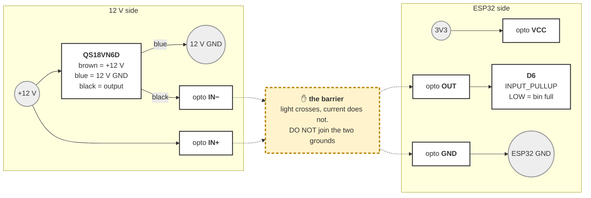
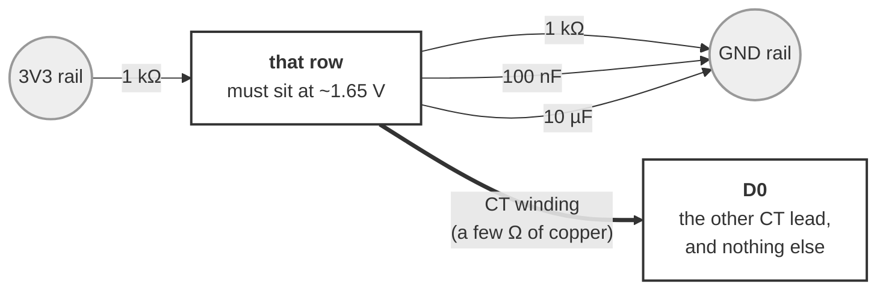
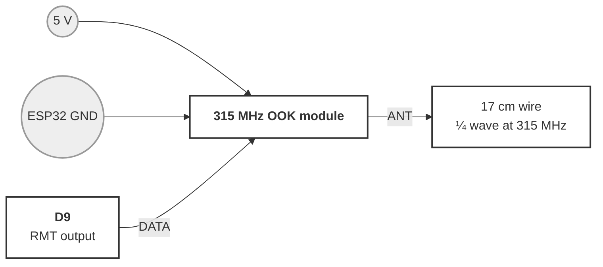
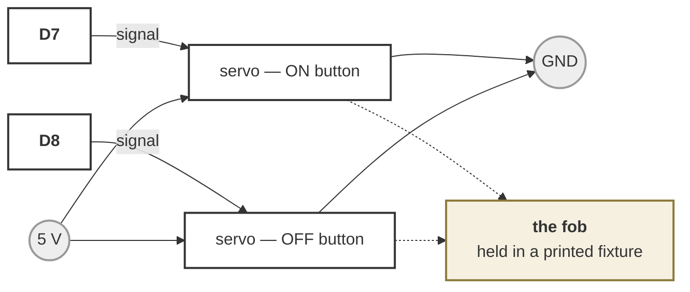

# Wiring — the collector node

**UNBUILT.** Written from the pin map and the bench rigs that proved each piece
separately, not from a board anyone has assembled. Nothing here has been powered
up as a whole.

One board at the dust collector, doing only collector things: watch the bin,
measure the blower's draw, press its remote, and drive lamps. It drives **no
gates**, which is the entire reason its pin budget works
([`../../docs/tool-sensing-rfc.md`](../../docs/tool-sensing-rfc.md) §6.2).

It is an ordinary NODE build — `xiao_c5`, same firmware as any other. What makes
it a collector node is what the *layout* asks of it, not what is flashed.

---

## 1. The pin budget, in full

Every pad on the board, so nothing looks free that is not.

| Pad | GPIO | Used for | Notes |
|---|---|---|---|
| `D0` | 1 | **CT clamp** | The only analog pad on this edge. Nothing else can do this job. |
| `D1` | 0 | Wake button | Momentary to GND, `INPUT_PULLUP` |
| `D2` | 25 | Status pixel | WS2812 DIN through 330 Ω |
| `D3` | 7 | — | **Strapping pin. Leave it alone.** |
| `D4` | 23 | OLED SDA | |
| `D5` | 24 | OLED SCL | |
| `D6` | 11 | **Bin sensor** | Opto output. LOW = full |
| `D7` | 12 | **Fob servo — ON** | Servo channel 1 |
| `D8` | 8 | **Fob servo — OFF** | Servo channel 2. Only on a two-button fob |
| `D9` | 9 | **315 MHz transmitter** | Servo channel 3 on a gate board — see below |
| `D10` | 10 | spare | Lamps, or a third fob button |

**Two of these are shared names, and both bite silently:**

- **`D9` is `SERVO_PWM_PIN_3`.** On a board that also drives gates, this pad is
  gate 3. Nothing detects the clash — which jobs a board does is a topology
  fact, not a build one. A collector node drives no gates, so it is free here.
- **`D3` is `GPIO7`, a strapping pin.** It is the one free-*looking* pad on this
  part that is not free. Do not use it, and especially not for an input that can
  be held LOW at reset.

---

## 2. Bin sensor — Banner QS18VN6D through an optocoupler

The beam sensor runs on 12 V and the ESP32 does not, so an opto crosses the gap
and keeps the two grounds independent of each other's noise.

**Two sides that never meet.** Build them as two separate circuits.

*The 12 V side — nothing here touches the ESP32:*

| | Goes from | To |
|---|---|---|
| Brown | QS18 | **+12 V** |
| Blue | QS18 | **12 V GND** |
| Black | QS18 (output) | **opto `IN−`** |
| Wire | **+12 V** | **opto `IN+`** |

*The ESP32 side — nothing here touches 12 V:*

| | Goes from | To |
|---|---|---|
| Wire | opto `VCC` | **3V3** |
| Wire | opto `GND` | **ESP32 GND** |
| Wire | opto `OUT` | **`D6`** |

**⚠️ DO NOT TIE THE 12 V GROUND TO THE ESP32 GROUND — on a two-supply build.**
See §6: if the board is powered by a plain 12→5 V buck off the same supply, the
grounds are ALREADY common through the regulator, this warning is moot, and the
opto is doing level shifting rather than isolation. What follows is about the
isolated case. The board header said to tie them
for weeks and this file repeated it; both were wrong, corrected 2026-09-11 when
Jeff asked whether *both* sides of the opto ground to the ESP32.

They do not, and that is the entire point of the part. Joining the grounds
shorts across the barrier and throws away the only thing an optocoupler does.

Nothing floats without it. **The opto's `GND` pin IS the ESP32 ground** — that is
the output side's reference, already connected in the second table. The 12 V
ground is the *input* side's reference and belongs to the 12 V supply alone.
Each side has its own return; they simply are not the same return.

Why it matters more here than in general: the 12 V supply sits beside a dust
collector — a large induction motor — feet from a CT clamp whose noise floor is
already unresolved (§3). A deliberate ground loop between that supply and the
ADC's reference is the last thing this board needs. And a fault on the 12 V side
would have a path straight through the ESP32's ground instead of staying on its
own side.

**A non-isolated build is allowed** — sensor straight to a pull-up, rejected in
§7.4 of the schema RFC but not forbidden — and that one has a single shared
ground by definition, plus the opposite polarity, which is what
`bin.sensor.invert` exists for. What is not allowed is the isolated wiring with
the barrier shorted out: all of the cost and none of the benefit.

**The polarity is inverted, and that is the wiring's fault, not a bug.** The opto
pulls the pin LOW when the beam reports full, so `D6` LOW = bin full. The pin is
read with `INPUT_PULLUP`, so an **unwired board reads HIGH = "bin OK"** — a board
with nothing connected must not scream. `bin.sensor.invert` in the layout exists
for anyone who wires the sensor straight to a pull-up instead and gets the
opposite polarity; that should not need a reflash.

---

## 3. CT clamp — the blower's own draw

The one place a CT is clearly worth having: a blower is a single large motor with
an unambiguous running draw, which is the easiest possible signal to separate
from noise.

Same rig as [`ct-bench.md`](ct-bench.md), and **read that file's warnings before
trusting a number** — the noise floor is unresolved and the screen is part of it.

**Pick one empty row on the perfboard.** Everything either goes into that row or
it does not.

| | Goes from | To |
|---|---|---|
| 1 kΩ | the `3V3` rail | **that row** |
| 1 kΩ | **that row** | the `GND` rail |
| 100 nF | **that row** | the `GND` rail |
| 10 µF | **that row** (long leg / `+`) | the `GND` rail |
| CT wire 1 | the CT | **that row** |
| CT wire 2 | the CT | **`D0`** |

**`D0` ends up with exactly one thing in it** — the other CT wire. It takes its
DC level *through the CT winding*, a few ohms of copper, so it rests halfway up
the supply with the signal on top. Anything else on `D0`, ground above all,
swamps the divider and pins the input.

**THERE IS NO RECTIFIER, AND THE CAPACITORS ARE NOT SMOOTHING CAPS.** This is
the part of the circuit most likely to be misread, because it looks exactly like
half of a rectifier-and-smoother and does the opposite job.

A CT puts out **AC** — this one, 1 V RMS at 30 A, swinging about zero. An ADC
cannot read a negative voltage, so something has to happen. The two obvious
options, and why only one of them is here:

| | |
|---|---|
| **Rectify and smooth** | A diode drops 0.7 V, or ~0.3 V Schottky, against a signal that is 1 V RMS at FULL 30 A scale. Below its forward voltage it conducts nothing at all — so the small end vanishes, and the small end is the entire question: telling an idle tool from a running one. |
| **Bias to mid-rail, RMS in software** ← | The divider moves the CT's zero to ~1.65 V, so the waveform never goes negative. Firmware samples flat out, subtracts the measured mean, and takes the RMS of what is left. |

`ct_bench.cpp` does the second: `var = sumSq/n − mean²`, then `sqrt`. True RMS,
arithmetically, with no diode anywhere.

Three things that buys:

- **Linear to nearly zero.** No forward voltage to get over, so the low end —
  where the answer lives — is not thrown away.
- **Correct for any waveform.** A motor's current is not a sine wave, and a
  rectify-and-smooth circuit assumes one. RMS of the samples does not.
- **Self-calibrating bias.** Subtracting the *measured* mean means the exact
  resistor values stop mattering; whatever DC level they produce is removed.

**So the 10 µF and the 100 nF hold the BIAS POINT stiff — they do not smooth the
signal.** Their job is to stop the CT's own current moving the reference it is
being measured against. A cap across the *signal* would destroy the measurement
rather than clean it up, which is why both go from that row to **GND** and
neither goes anywhere near `D0` alone.

**1 kΩ, not the 10 kΩ of the original bench rig.** 10 k/10 k presents 5 kΩ to the
ADC — high enough that the sampling capacitor does not settle, and a fine antenna
besides. 1 k halves the source impedance to 500 Ω for 3.3 mA, which is nothing on
USB power. The 100 nF is there because the electrolytic does nothing above a few
kHz, which is exactly where the screen's charge pump lives (`ct-bench.md` §5.5).
**Both changes are unvalidated.**

**Check before believing anything:** meter between that row and GND should read
**~1.65 V**. `0 mV` or `3300 mV` means the input is railed and every reading is
fiction — the variance of a constant is zero, which looks exactly like a
perfectly quiet sensor.

**Clamp ONE conductor.** Hot or neutral, never the whole cord: an intact cord's
fields cancel, tested and closed 2026-09-09 (§5.4). A line splitter, or one
conductor exposed.

---

## 4. 315 MHz transmitter — pressing the remote

One wire of signal. The module is keyed with the collector remote's own HT12E
frame, so its receiver cannot tell the difference
([`../control/RfCollectorPresser.h`](../control/RfCollectorPresser.h)).

| | Goes from | To |
|---|---|---|
| Wire | module `VCC` | **5 V** |
| Wire | module `GND` | **ESP32 GND** |
| Wire | module `DATA` | **`D9`** |
| Wire | module `ANT` | **17 cm of wire, and nothing else** |

**5 V, not 3.3 V.** The cheap modules will run on 3.3 V and transmit almost
nothing; range comes from the supply. The `DATA` input is happy with a 3.3 V
logic level, so this needs no level shifting in the direction that matters.

**The antenna is worth more than everything else here.** 17 cm of solid wire on
the `ANT` pad is a quarter wave at 315 MHz. Without it the module works across a
bench and nowhere else.

**Nothing transmits until the layout says so** — `control.rf` — or until someone
types `press` at the serial console.

---

## 5. Fob servos — pressing the remote mechanically

The alternative to §4, and the one that ships: no transmitter, no reverse
engineering, and the fob stays an unmodified certified device (§4.2a). Standard
3-wire hobby servos.

| | Goes from | To |
|---|---|---|
| Servo 1 signal | ON button servo | **`D7`** |
| Servo 2 signal | OFF button servo | **`D8`** |
| Servo `+` (both) | | **5 V** |
| Servo `−` (both) | | **ESP32 GND** |

**⚠️ THE SERVO CLASS IS UNSETTLED (2026-09-11).** Everything below, and the 5 V
budget in §6, assumes **9 g servos** — right for a fob button, which is a light
spring and a short travel. It is very likely WRONG for the better option:
actuating the **collector's own paddle or starter button** instead of its remote
(`tool-sensing-rfc.md` §4.2c). That is a real mechanical switch with a detent,
and a magnetic starter's button is deliberately firm — metal-gear territory, the
same class the gates use, and a different current draw.

**Measure the switch before buying a servo.** It may also change which isolated
converter §6 recommends, if topology C is ever needed.

**Two servos, and the second is not a spare.** One servo presses one button, and
a single-button fob is a **toggle** — stateless, so a missed or doubled press
inverts what the system believes. A fob with **separate ON and OFF buttons** is
momentary to press but **idempotent in meaning**: pressing ON twice leaves it on.
One extra pad buys a control that cannot invert (§4.2b). A single-button fob uses
`D7` and leaves `D8` unwired.

**The fixture is the safety-critical part.** An arm that drifts, or a fob that
shifts under a shop's vibration, misses the press — and on a toggle that inverts
the system's belief permanently. Fob and servo must be rigid *relative to each
other*, which means one printed part holding both, not two parts screwed to a
bench.

**Never on a tool's own switch.** This is scoped to the collector. A servo that
can throw a table saw's start switch is exactly the unattended-start hazard the
whole project is built to avoid, and mechanical makes it worse than electrical
because it defeats any no-volt-release the switch was chosen to provide.

---

## 6. Power

**THERE IS A CHOICE HERE AND §2 ASSUMED ONE WITHOUT SAYING SO.** Corrected
2026-09-11, when Jeff asked how the 12 V ground ties to a 12→5 V regulator. The
answer is that it does, straight through — **a plain buck converter shares its
input and output ground by definition** — so on a single-supply build the two
grounds are already common upstream and §2's barrier is bypassed before the
optocoupler ever sees it.

Three topologies. Pick one deliberately.

| | Supplies | Grounds | What the opto is doing |
|---|---|---|---|
| **A. Two bricks** | 12 V for the sensor, USB for the board | **separate** | Isolating, as §2 describes |
| **B. One 12 V + plain buck** | one 12 V, buck to 5 V | **common, through the buck** | **Level shifting only** |
| **C. One 12 V + isolated DC-DC** | one 12 V, isolated 12→5 module | separate | Isolating, on one supply |

**DECIDED: A FIRST (Jeff, 2026-09-11), then B once it works.**

Not because A is better — it is the worse install, two bricks and two outlets
at a machine that already has a cord and a remote and a duct. Because it is the
**baseline**, and this board has too many unknowns to add an avoidable one.

The reasoning is worth keeping, because the first version of this note had it
backwards. It said "build B, upgrade if the CT fails" — which sounds thrifty and
is bad diagnosis: **a noisy CT on B tells you nothing**, because you cannot tell
a shared-ground problem from the screen's charge pump, from the divider, from
the clamp, or from the motor itself. §3 already has three unvalidated changes in
it. Adding a shared ground underneath them means a failure has four candidate
causes and no reference to compare against.

A removes one variable for the price of a second power brick. Then **B becomes a
measurable change** rather than a guess: same board, same clamp, same firmware,
one thing different, and a known-good reading to compare to. If B matches A, the
install gets simpler for free. If it does not, that IS the answer about shared
grounds, and C is the fix that keeps one brick.

**B is still the better install**, which is why it is what to aim at. One brick
at the collector,
one cord, one thing to plug in — against A's two bricks and two outlets, at a
machine that already has a cord and a remote and a duct. Do not pick A for
isolation you then throw away with a shared chassis or a common earth anyway.

**On B the optocoupler still earns its place**, and this is the part worth being
clear about, because "the isolation is gone" reads as "the part is pointless".
It is not. The QS18's output swings to **12 V**, and 12 V on a 3.3 V GPIO
destroys it. The opto translates that to a 3.3 V-referenced signal and keeps the
pin behind a barrier from a wire that runs across a shop. Two jobs; B keeps one.

If you build B, **§2's warning does not apply** — there is no barrier left to
short — and the rest of §2 stands unchanged, because the opto is wired the same
either way.

**C is the one to choose if the noise turns out to matter.** The reason to care
is in §3: a CT clamp, feet from an induction motor, on a board whose ADC noise
floor is unresolved. If the CT proves unusable on a shared ground, an isolated
DC-DC is the fix that keeps the single-brick install.

#### If you build C: which part, and the budget that decides it

"Isolating buck" is a contradiction — a buck is non-isolated by definition, one
inductor and a shared return. The parts are flybacks, sold as **isolated DC-DC
converters**.

| | | |
|---|---|---|
| **No fob servos** | [Traco **TMR 3-1211**](https://www.tme.com/us/en-us/details/tmr3-1211/dc-dc-converters/traco-power/tmr-3-1211/) | 9–18 V in, 5 V / **600 mA**, 3 W, regulated, SIP8 |
| **With fob servos** | [Traco **TMR 6-1211**](https://www.tracopower.com/model/tmr-6-1211) | same, 5 V / **1.2 A**, 6 W |

Mornsun's URB1205S series is the cheaper equivalent of either.

**Buy REGULATED.** The 1–2 W unregulated parts (`B1205S-1W` and friends) are
cheap and wrong here: their output sags with load, which is exactly the failure
mode a lumpy load produces.

**The budget, and the two corrections that got it here.** Base load is about
400 mA peak — ESP32-C5 ~250–300 mA on WiFi TX, OLED ~20 mA, pixel up to 60 mA,
transmitter ~30 mA while keying. Then:

- **Only one fob servo is ever moving.** Pressing ON and OFF at the same moment
  is meaningless, so a two-button fob still budgets for ONE servo. (The first
  version of this note doubled it.)
- **A button press is not a stall.** A gate valve loads a servo continuously; a
  fob button is a short travel against a light spring, and `ServoActuator` does
  move-then-detach, so nothing holds torque afterwards. A **9 g servo** (SG90
  class — which is all a button needs, not the metal-gear kind the gates use)
  draws a couple of hundred mA doing that, against ~650 mA if it jams.

So ~400 mA base plus one small servo lands comfortably inside 1.2 A and
uncomfortably against 600 mA. **TMR 6-1211 for any build with a fob servo**,
TMR 3-1211 only for RF-only.

**Bulk capacitance does NOT substitute for headroom.** Holding 1 A for 200 ms
within half a volt needs about 0.4 F. Size the converter.

**And you cannot split the rails.** Feeding the servos from a separate
non-isolated buck off the same 12 V looks like a cheap way out and is not: a
servo's ground must be common with whatever drives its signal pin, and that is
the ESP32 on the isolated side. Splitting puts the servo signal across the
barrier with no shared return.

**Check it on arrival, in one second:** meter on continuity between input GND
and output GND. **An isolated module reads open; a plain buck reads ~0 Ω.** Do
not trust the label — that measurement is the whole claim.

| Rail | Feeds | From |
|---|---|---|
| 5 V | the board, the transmitter, the servos | USB brick (A) or a buck off 12 V (B/C) |
| 3V3 | the CT divider, the opto's output side | the board's regulator |
| 12 V | the QS18 beam sensor, lamps | the 12 V supply |

**Never join 12 V to 5 V or 3V3.** That is true in all three, and is a different
claim from the ground question — the RAILS never meet, whatever the grounds do.

**Nothing has been built**, so none of this is a result yet. Build A, get a CT
reading that separates a running blower from a quiet one, and only then try B —
with A's numbers in hand to compare against. See §3 and §7.

**Servos and a transmitter share the 5 V rail, and both are lumpy loads.** A
servo stalls at an amp or more and an OOK module keys hard. Neither has been
measured together on one brick. If the transmitter becomes unreliable *while a
servo moves*, that is the first thing to suspect — and the two are never needed
at the same instant, so staggering them in firmware is available before adding
hardware.

---

## 7. What is unverified

Everything, as a whole board. The pieces have separate histories:

| Piece | State |
|---|---|
| Bin sensor + opto | Wiring proven; `test_binsensor.cpp` covers the debounce |
| CT clamp | Rig works, **numbers do not** — noise floor unresolved, §5.5 |
| 315 MHz transmit | **Proven end to end** on `ht12e_bench.cpp` against the real receiver |
| Fob servos | Nothing built. No fixture designed |
| All of it on one board | **Never assembled** |

The specific unknowns worth naming:

- **Whether the 1 kΩ divider and the 100 nF actually fix the screen's charge
  pump coupling into the CT** (§3). Both changes are reasoned, neither measured.
- **Whether a shared ground (topology B) is good enough for the CT** (§6). This
  is the one that decides whether an isolated supply gets bought. A CT clamp
  feet from an induction motor, sharing a ground with the 12 V supply that
  motor's sensor runs on, is the least favourable arrangement in the document —
  and it is the one being built first, on purpose, because the parts are on
  hand and the alternative costs a converter to answer a question nobody has
  asked yet.
- **Whether the servos and the transmitter can share a 5 V supply** (§6). Both
  are lumpy; never measured together. They are never *needed* at the same
  instant, so staggering them in firmware is available before adding hardware.
