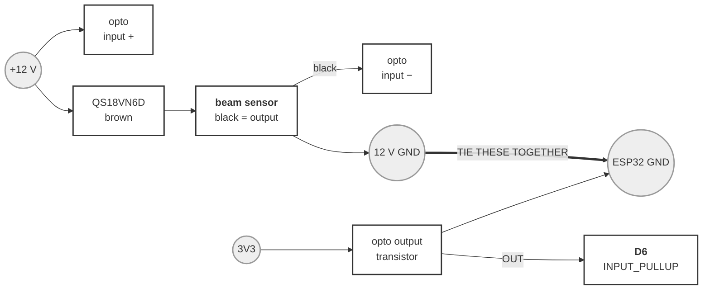
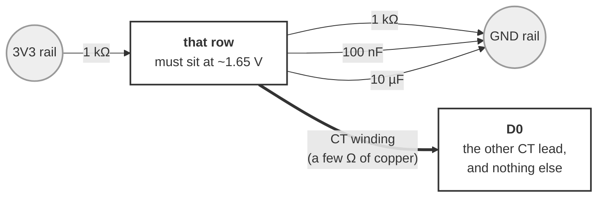
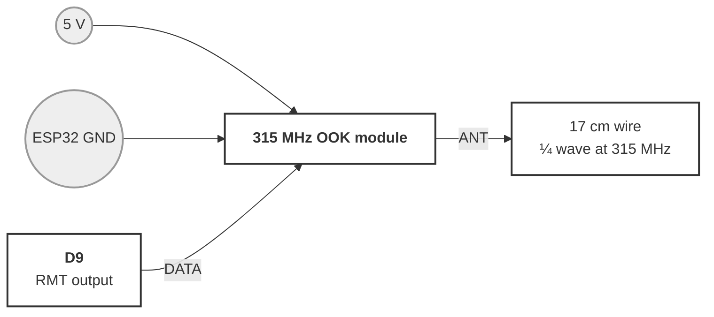
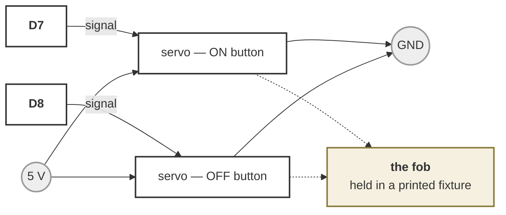

# Wiring — the collector node

**UNBUILT.** Written from the pin map and the bench rigs that proved each piece
separately, not from a board anyone has assembled. Nothing here has been powered
up as a whole.

One board at the dust collector, doing only collector things: watch the bin,
measure the blower's draw, press its remote, and drive lamps. It drives **no
gates**, which is the entire reason its pin budget works
([`../../docs/tool-sensing-rfc.md`](../../docs/tool-sensing-rfc.md) §6.2).

It is an ordinary NODE build — `xiao_c5`, same firmware as any other. What makes
it a collector node is what the *layout* asks of it, not what is flashed.

---

## 1. The pin budget, in full

Every pad on the board, so nothing looks free that is not.

| Pad | GPIO | Used for | Notes |
|---|---|---|---|
| `D0` | 1 | **CT clamp** | The only analog pad on this edge. Nothing else can do this job. |
| `D1` | 0 | Wake button | Momentary to GND, `INPUT_PULLUP` |
| `D2` | 25 | Status pixel | WS2812 DIN through 330 Ω |
| `D3` | 7 | — | **Strapping pin. Leave it alone.** |
| `D4` | 23 | OLED SDA | |
| `D5` | 24 | OLED SCL | |
| `D6` | 11 | **Bin sensor** | Opto output. LOW = full |
| `D7` | 12 | **Fob servo — ON** | Servo channel 1 |
| `D8` | 8 | **Fob servo — OFF** | Servo channel 2. Only on a two-button fob |
| `D9` | 9 | **315 MHz transmitter** | Servo channel 3 on a gate board — see below |
| `D10` | 10 | spare | Lamps, or a third fob button |

**Two of these are shared names, and both bite silently:**

- **`D9` is `SERVO_PWM_PIN_3`.** On a board that also drives gates, this pad is
  gate 3. Nothing detects the clash — which jobs a board does is a topology
  fact, not a build one. A collector node drives no gates, so it is free here.
- **`D3` is `GPIO7`, a strapping pin.** It is the one free-*looking* pad on this
  part that is not free. Do not use it, and especially not for an input that can
  be held LOW at reset.

---

## 2. Bin sensor — Banner QS18VN6D through an optocoupler

The beam sensor runs on 12 V and the ESP32 does not, so an opto crosses the gap
and keeps the two grounds independent of each other's noise.

| | Goes from | To |
|---|---|---|
| Brown | QS18 | **+12 V** |
| Blue | QS18 | **12 V GND** |
| Black | QS18 (output) | **opto input −** |
| Wire | **+12 V** | **opto input +** |
| Wire | opto out `VCC` | **3V3** |
| Wire | opto out `GND` | **ESP32 GND** |
| Wire | opto `OUT` | **`D6`** |
| Wire | **12 V GND** | **ESP32 GND** |

**TIE THE 12 V GROUND TO THE ESP32 GROUND.** The optocoupler isolates the
*signal*; it does not give the two supplies a shared reference, and without one
the input floats.

**The polarity is inverted, and that is the wiring's fault, not a bug.** The opto
pulls the pin LOW when the beam reports full, so `D6` LOW = bin full. The pin is
read with `INPUT_PULLUP`, so an **unwired board reads HIGH = "bin OK"** — a board
with nothing connected must not scream. `bin.sensor.invert` in the layout exists
for anyone who wires the sensor straight to a pull-up instead and gets the
opposite polarity; that should not need a reflash.

---

## 3. CT clamp — the blower's own draw

The one place a CT is clearly worth having: a blower is a single large motor with
an unambiguous running draw, which is the easiest possible signal to separate
from noise.

Same rig as [`ct-bench.md`](ct-bench.md), and **read that file's warnings before
trusting a number** — the noise floor is unresolved and the screen is part of it.

**Pick one empty row on the perfboard.** Everything either goes into that row or
it does not.

| | Goes from | To |
|---|---|---|
| 1 kΩ | the `3V3` rail | **that row** |
| 1 kΩ | **that row** | the `GND` rail |
| 100 nF | **that row** | the `GND` rail |
| 10 µF | **that row** (long leg / `+`) | the `GND` rail |
| CT wire 1 | the CT | **that row** |
| CT wire 2 | the CT | **`D0`** |

**`D0` ends up with exactly one thing in it** — the other CT wire. It takes its
DC level *through the CT winding*, a few ohms of copper, so it rests halfway up
the supply with the signal on top. Anything else on `D0`, ground above all,
swamps the divider and pins the input.

**1 kΩ, not the 10 kΩ of the original bench rig.** 10 k/10 k presents 5 kΩ to the
ADC — high enough that the sampling capacitor does not settle, and a fine antenna
besides. 1 k halves the source impedance to 500 Ω for 3.3 mA, which is nothing on
USB power. The 100 nF is there because the electrolytic does nothing above a few
kHz, which is exactly where the screen's charge pump lives (`ct-bench.md` §5.5).
**Both changes are unvalidated.**

**Check before believing anything:** meter between that row and GND should read
**~1.65 V**. `0 mV` or `3300 mV` means the input is railed and every reading is
fiction — the variance of a constant is zero, which looks exactly like a
perfectly quiet sensor.

**Clamp ONE conductor.** Hot or neutral, never the whole cord: an intact cord's
fields cancel, tested and closed 2026-09-09 (§5.4). A line splitter, or one
conductor exposed.

---

## 4. 315 MHz transmitter — pressing the remote

One wire of signal. The module is keyed with the collector remote's own HT12E
frame, so its receiver cannot tell the difference
([`../control/RfCollectorPresser.h`](../control/RfCollectorPresser.h)).

| | Goes from | To |
|---|---|---|
| Wire | module `VCC` | **5 V** |
| Wire | module `GND` | **ESP32 GND** |
| Wire | module `DATA` | **`D9`** |
| Wire | module `ANT` | **17 cm of wire, and nothing else** |

**5 V, not 3.3 V.** The cheap modules will run on 3.3 V and transmit almost
nothing; range comes from the supply. The `DATA` input is happy with a 3.3 V
logic level, so this needs no level shifting in the direction that matters.

**The antenna is worth more than everything else here.** 17 cm of solid wire on
the `ANT` pad is a quarter wave at 315 MHz. Without it the module works across a
bench and nowhere else.

**Nothing transmits until the layout says so** — `control.rf` — or until someone
types `press` at the serial console.

---

## 5. Fob servos — pressing the remote mechanically

The alternative to §4, and the one that ships: no transmitter, no reverse
engineering, and the fob stays an unmodified certified device (§4.2a). Standard
3-wire hobby servos.

| | Goes from | To |
|---|---|---|
| Servo 1 signal | ON button servo | **`D7`** |
| Servo 2 signal | OFF button servo | **`D8`** |
| Servo `+` (both) | | **5 V** |
| Servo `−` (both) | | **ESP32 GND** |

**Two servos, and the second is not a spare.** One servo presses one button, and
a single-button fob is a **toggle** — stateless, so a missed or doubled press
inverts what the system believes. A fob with **separate ON and OFF buttons** is
momentary to press but **idempotent in meaning**: pressing ON twice leaves it on.
One extra pad buys a control that cannot invert (§4.2b). A single-button fob uses
`D7` and leaves `D8` unwired.

**The fixture is the safety-critical part.** An arm that drifts, or a fob that
shifts under a shop's vibration, misses the press — and on a toggle that inverts
the system's belief permanently. Fob and servo must be rigid *relative to each
other*, which means one printed part holding both, not two parts screwed to a
bench.

**Never on a tool's own switch.** This is scoped to the collector. A servo that
can throw a table saw's start switch is exactly the unattended-start hazard the
whole project is built to avoid, and mechanical makes it worse than electrical
because it defeats any no-volt-release the switch was chosen to provide.

---

## 6. Power

| Rail | Feeds | From |
|---|---|---|
| 5 V | the board, the transmitter, the servos | USB brick |
| 3V3 | the CT divider, the opto's output side | the board's regulator |
| 12 V | the QS18 beam sensor, lamps | separate supply |

**The 12 V ground must meet the ESP32 ground** (§2). The 12 V rail must **not**
meet 5 V or 3V3 anywhere else.

**Servos and a transmitter share the 5 V rail, and both are lumpy loads.** A
servo stalls at an amp or more and an OOK module keys hard. Neither has been
measured together on one brick. If the transmitter becomes unreliable *while a
servo moves*, that is the first thing to suspect — and the two are never needed
at the same instant, so staggering them in firmware is available before adding
hardware.

---

## 7. What is unverified

Everything, as a whole board. The pieces have separate histories:

| Piece | State |
|---|---|
| Bin sensor + opto | Wiring proven; `test_binsensor.cpp` covers the debounce |
| CT clamp | Rig works, **numbers do not** — noise floor unresolved, §5.5 |
| 315 MHz transmit | **Proven end to end** on `ht12e_bench.cpp` against the real receiver |
| Fob servos | Nothing built. No fixture designed |
| All of it on one board | **Never assembled** |

The specific unknowns worth naming: whether the screen's charge pump still
poisons the CT with the 1 kΩ divider (§3), and whether the servos and the
transmitter can share a 5 V brick (§6).
