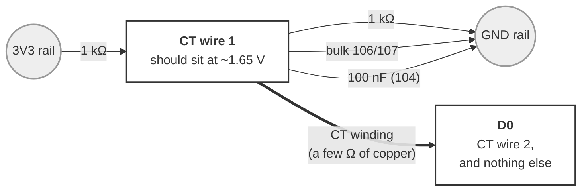

# Wiring — CT walk-around meter

**Untested.** Written alongside the firmware, not after using it.

Answers one question: **can a 30 A clamp tell a running tool from an idle one**,
well enough for DustGate's routing. Firmware:
[`../bench/ct_bench.cpp`](../bench/ct_bench.cpp), env `xiao_c5_ct_bench`.

## Wiring

**REWRITTEN 2026-09-06 — the first version was a confusing schematic and got the
rig built with D0 at ground, which reads a beautiful and entirely fictional
0.000 A.** So: as a build, not a drawing.

**Pick one empty row on the breadboard and put CT wire 1 in it.** That row is now
called **CT wire 1**, and everything below either lands in it or does not.

| | Goes from | To |
|---|---|---|
| 1 kΩ — `brown black red gold` | the `3V3` rail | **CT wire 1** |
| 1 kΩ — `brown black red gold` | **CT wire 1** | the `GND` rail |
| bulk cap — `106` or `107` | **CT wire 1** | the `GND` rail |
| 100 nF — `104` | **CT wire 1** | the `GND` rail |
| CT wire 2 | the CT | **`D0`** |



CT wire 1's row ends up with five things in it: two resistor legs, two capacitor
legs, and CT wire 1 itself. **`D0` ends up with exactly one thing in it** — CT
wire 2 — and that is the part that matters. D0 takes its DC level *through the CT
winding*, which is a few ohms of copper, so it rests halfway up the supply with
the CT's signal on top. Anything else on D0, ground above all, swamps the two
resistors and pins the input.

### Reading the markings

Band colours and the `104`/`106`/`107` cap codes are in
[`passives.md`](passives.md) — one page rather than a copy per rig. The two you
need here: **1 kΩ is `brown black red gold`**, and **`104` is the 100 nF**.
Ceramics are not polarised; only an electrolytic bulk cap has a `+` leg.

**Use 1 kΩ, not the 10 kΩ this page specified until 2026-09-14** — see the
divider note below.

**The check, before believing any number.** Meter between CT wire 1 and GND: it
should read **~1.65 V**, which is just the two resistors halving 3.3 V. The
console also prints `DC ####mV` on every status line and it should say the same.
`0mV` or `3300mV` means the input is railed, and every reading is meaningless —
the variance of a constant is zero, which looks exactly like a perfectly quiet
sensor.

Cut the 3.5 mm plug off the SCT-013 and use the bare wires; polarity does not
matter for an RMS reading.

**Check it before believing any number:** the console prints `DC ####mV` on every
line. It must read **~1650 mV**. `0mV` or `3300mV` means the input is railed and
every reading is meaningless — the variance of a constant is zero, which looks
exactly like a perfectly quiet sensor.

| | |
|---|---|
| CT | **SCT-013-030** — 30 A → 1 V RMS, burden built in. Confirm the listing says **30A/1V**; the 30A/1A variants have no burden |
| Bias | **2× 1 kΩ** from 3V3 and GND, 100 µF + 100 nF from the midpoint to GND |
| | Re-measured on this divider 2026-09-16 and the scale held: CT 11.310 A against a Tasmota's 11.143 A, +1.50%, where the 10 kΩ rig read +0.94%. The older figures further down this page were taken on 10 kΩ/10 kΩ + 10 µF and are kept as the record of what was measured then. RFC §5.4c. |
| ADC | **D0** (GPIO1) — the only analog pad on the edge |
| Screen | SSD1306 on **D4/D5**, 0x3C. Optional; probed at boot like every other board |
| Power | Any USB power bank |

**The exact divider does not matter** *for scale*. The firmware measures the mean
and subtracts it, so a lazy midpoint and a drifting reference both come out in
the wash. There is no trim.

**It matters for the NOISE FLOOR, though not in the way §5.5 predicted — and the
answer, measured 2026-09-16, is that neither divider is the limit.** 1 kΩ/1 kΩ
removed the SCREEN's contribution (from ~80% of the floor to 11%), and what was
left underneath is **the C5 ADC's own noise, about 6 counts RMS**. Shorting the
CT out entirely does not move it. RFC §5.5b has the elimination chain; the short
version is that no wiring change improves this and the remaining lever is a 60 Hz
demodulator, deliberately not built because a running collector sits 63× above
the floor and one bit is all §5.4b ever needed.

⚠️ **The `Hz` column lies when there is no signal.** Fed broadband noise, the
zero-crossing counter reports a fraction of the SAMPLE RATE — measured at
0.250×Fs and 0.253×Fs on two builds — not a tone in the room. An hour went into
hunting a 6.5 kHz aggressor that did not exist. Divide by kSPS before believing
it. The table above records **what this rig actually had while every
number on this page was measured** — deliberately, since rewriting it would
misrepresent the measurements. New builds should use **1 kΩ/1 kΩ plus a 100 nF
ceramic at the pin** (RFC §5.2), starting with the tool node in RFC §5.6.

One thing the divider also sets is how long the midpoint takes to arrive:
tau = (R/2) x C, settle ~ 5 tau. 10k/10k with a 100 µF bulk cap is **2.5 s**;
1k/1k with the same cap is 250 ms. Irrelevant to a human typing `ct`, and
load-bearing for RFC §5.4b, which learns the board's floor at boot —
`CtSensor::kBiasSettleMs` (3 s) and `Reading.settling` exist for exactly that,
because `isRailed()` cannot see a midpoint that is still on its way up.

**⚠️ Clamp ONE conductor.** Around a whole appliance cord, hot and neutral cancel
and it reads about zero. Use a line splitter's **1X** loop, or clamp inside the
tool's own wiring compartment.

## Using it

```
zero      measure the NOISE FLOOR — clamp around a DE-ENERGISED conductor
clear     reset the peak hold
log <n>   n one-second samples as CSV
q         quiet: screen only
```

**Run `zero` first, and do it properly** — clamped around a dead wire, not
dangling in mid-air. A clamped jaw picks up differently from an open one, and the
floor is the number every other reading gets judged against.

Then walk: clamp a tool's hot leg, note the idle reading, switch it on, read the
peak. `clear` between tools.

## The scale is CORRECT — three-way agreement, 2026-09-13

**This is the result the whole file was waiting for, and it arrived from a
direction nobody was looking: the clamp was never wrong, the SOFTWARE was.**

A 1 HP collector, running, measured three ways at the same moment:

| | Amps |
|---|---|
| Handheld clamp meter | 10–11 |
| Tasmota metering plug (`Status 8`) | **10.610** |
| This CT, scale corrected | **10.71** |

Within ~1%. `kAmpsPerVolt = 30.0f`, the bias network, and the rectifier-free
arithmetic RMS are all confirmed against two independent instruments.

### The bug that hid it: a one-sample scale factor

`read()` derived its mV-per-count from a **single** `analogReadMilliVolts()`,
and that factor scales every amp figure linearly. Ten consecutive reads of a
steady collector printed this:

```
[CT] 13.100 A  ...  DC 1940mV (1667 counts)
[CT] 12.245 A  ...  DC 1831mV (1675 counts)
[CT] 10.186 A  ...  DC 1518mV (1676 counts)
[CT]  8.889 A  ...  DC 1313mV (1659 counts)
```

A 32% collapse that looks exactly like a motor spinning down. Back the raw
`rmsCounts` out of those same rows and it is **371–375 — a 1% spread.** The
measurement never moved. A second run on another day gave 368–373: the same
number, reproducibly, while `amps` ranged 8.889 to 14.639 across the two.

**Why it scaled with the signal, which is what made it convincing.** With ~370
counts RMS of AC on the pin, the instantaneous value swings roughly ±500 counts
around the 1667 bias, so one sample lands anywhere from ~1300 to ~2200 mV — the
exact range observed. With the load OFF (76 counts RMS) the swing was small and
`dcMv` only moved 1603–1805. A quiet input hid it; a real load exposed it.

**That is the worst shape a bug can have here: it does not look like a fault, it
looks like data.** Anyone logging the amps column would have written down a load
that was not changing.

Both fixes are in `sensing/CtSensor.h`:

- **mV-per-count is averaged over 64 samples** (~1 ms). It is a per-chip ADC
  calibration constant and should not vary between windows at all. `dcMv` comes
  from the same average, so `isRailed()` now judges the bias from 64 samples
  too — it was one, and could have cried rail on a glitch.
- **`rmsCounts` is a printed column.** `amps` is a scaled view of it, so the two
  disagreeing across consecutive reads is a *scale* fault rather than a changing
  load. With this column on screen the bug is one glance instead of a session.

**Log `rmsCounts`, not `amps`, for anything you intend to compare later.**

### The noise floor is ELECTRONIC, and that answers the §5.4 pickup question

The `Hz` column was added on 2026-09-07 to settle exactly this and had never
been read. With the collector **off**, ten reads:

```
[CT]  2.194 A   1035.0 Hz   DC 1608mV (1667 counts)
[CT]  2.198 A   1055.0 Hz   DC 1613mV (1667 counts)
```

**~1055 Hz. The rule this file wrote down says ~60 Hz is magnetic pickup and
anything above ~500 Hz is electronics.** So the dominant noise is NOT the CT
sitting in the ambient field — it is in the ESP32 path. Distance, orientation
and shielding will not fix it; the front end is where to look.

Two honest caveats:

- The floor is **~76 counts RMS ≈ 2.2 A**, which is an order of magnitude worse
  than the 0.253 A measured on 2026-09-07. That is a different location — on a
  collector's input conductor inside its enclosure, not on a bench — so the two
  are not comparable and the increase is **unexplained**.
- The zero-crossing counter over-reports when noise dominates, since noise adds
  spurious crossings. 1055 Hz is not a clean spectral line; it is "well above
  60", which is all the test needed to decide.

**IT IS NOT THE SCREEN, and that was assumed here for about an hour before Jeff
said so.** Every reading above was taken with **no OLED connected at all**:

| | Floor |
|---|---|
| Bench, 2026-09-06, OLED unplugged | **< 0.03 A** |
| Here, 2026-09-13, OLED unplugged | **~2.2 A** |

~70x worse with the panel absent in both cases, so whatever injects ~1 kHz
arrived with the LOCATION or the SETUP, not the charge pump. §5.5 of the RFC is
still right that the screen is a noise source; it is simply not the source of
this. An A/B with the panel plugged back in is still worth taking, but it now
measures an increment on top of an already-bad floor rather than explaining it.

**~1 kHz is a switching supply's signature** — too high for 60 Hz magnetic
pickup, too low for RF. So the question is which one, and one candidate is
already eliminated: the board is USB-powered from a laptop **running on
battery**, so there is no mains path into the ground through USB. Three left:

- **The laptop's own DC-DC rails**, which run on battery as well.
- **The 12 V supply for the bin sensor and lamps**, sitting beside the CT. That
  one IS a mains-connected switching supply, just not reaching the board through
  USB. On topology A it is isolated from the ESP32's ground — but isolation does
  nothing about a coil sitting in its field.
- **Our own front end.**

Test 2 below separates the last from the first two, which is why it is the run
worth taking next.

### The queue was run, and it answered a different question (2026-09-13)

Five conditions, collector OFF throughout, no firmware change between them —
which is the reason the comparison survives at all, since `rmsCounts` is immune
to the scale bug below while `amps` on that build is not.

| Condition | `rmsCounts` | vs. best |
|---|---|---|
| **On the collector's input line, as built** | **79.7** — *flat to 0.8%* | — |
| CT closed, carried well away | 201 → 254, *drifting* | 3x |
| Carried back to the original position | 445 | 5.6x |
| + shield grounded at the board end | 414 | 5.2x |
| + screen plugged back in | 426 | 5.3x |

**The floor never came back, and that is the finding.** Row 1 was taken before
the board was picked up; every row after it is 5x worse in the same position
with the same wiring. Two things moved together and neither has recovered:

- `dcCounts` went **1671 → 1744 → 1778** and stayed there. Ambient field cannot
  do that: magnetic pickup is AC and its mean is zero, so a shifted DC bias
  means the CIRCUIT changed, not the environment.
- The reading stopped being flat. Row 1 held 0.8% across ten reads; row 2 climbs
  monotonically through the run.

**It is a breadboard.** A spring contact on a high-impedance analog node is
exactly the thing that changes value when the board is carried across a shop.
Rebuilding on perfboard is the next step — note the direction, since soldered
perf is the CLEANER platform here and breadboard the looser one.

**Both interventions are real, and both are swamped.** Grounding the shield
bought ~7%; the screen cost ~3%, which in quadrature is the screen contributing
roughly 60–110 counts on its own — about the size of the ENTIRE original floor,
and consistent with §5.5's 2026-09-06 result. But resolving a 100-count effect
on top of a 400-count platform fault is not a measurement. **Nothing in this
queue is worth re-running until row 1's 79.7 is back.**

**The divider is already 1k/1k, which disproves half of the 2026-09-06 theory.**
That change was proposed because 5 kΩ of source impedance was suspected of
picking up the noise. It is 500 Ω now and the floor is still bad, so the divider
was not the mechanism.

**And the specified 100 nF is two orders of magnitude too small to matter.**
Against 500 Ω it corners at ~3.2 kHz — the noise is at ~1 kHz, BELOW the corner,
attenuated by about 4%. To cut 1 kHz meaningfully the corner wants to be a few
hundred Hz: at 200 Hz, 1 kHz drops ~5x while 60 Hz loses only ~4%, and that 4%
is a fixed scale error that calibrates straight out against the Tasmota. The
sizing catch is that the impedance the cap works against is probably **the CT's
own internal burden (~60 Ω)**, not the divider — which puts a 200 Hz corner at
order **10 µF**. Check that against the actual topology before buying; the
direction is what is certain, not the value.

### Measured loads, and the 240 V problem they expose (2026-09-13)

Everything measured through the Tasmota unless noted; inrush from a handheld
clamp meter. `rmsCounts` estimated at 0.99 mV/count, against the best floor this
rig has produced (**79.7**, on the collector's line before the breadboard was
disturbed).

| Load | Current | est. `rmsCounts` | vs. floor |
|---|---|---|---|
| SawStop, **standby** | 0.043 A (2 W) | ~1.4 | invisible — and that is the RIGHT answer |
| SawStop, running, not cutting | 4.99 A (455 W, PF 0.77) | ~168 | **2.3x** in quadrature |
| Collector, running | 10.6 A (729 W, PF 0.60) | ~370 | **4.6x** |
| Jointer, running, no load | 8.5 A | ~286 | **3.7x** |
| SawStop, **inrush** | **78 A** | ~2600 | **8x past full scale** |
| **Planer, 2 HP, 220 V, no load** | **7 A** | ~236 | **3.1x** — the CT's own use case |
| Jointer, **inrush** | **90 A** | ~3000 | **9x past full scale** |
| Planer, **inrush** | **90 A** | ~3000 | **9x past full scale** |
| Collector, inrush | 45–50 A | ~1600 | 5x past full scale |

Inrush against running current, per tool: collector **4.5x**, jointer **10.6x**,
SawStop **15.6x**. Every tool in this shop passes 30 A on start, by 1.5x to 3x.

**Standby being invisible is a feature, not a limitation.** The hazard a noisy
CT creates is a FALSE POSITIVE — a tool that reads as running when it is not —
and a standby draw 50x below the floor cannot produce one. §5.4a asks only for
*running beyond standby*, and the bottom of that range is answered.

**THE 240 V PATH IS FINE — measured, after an extrapolation said otherwise.**

This paragraph briefly claimed the opposite, and the mistake is worth keeping
because it is an easy one to make again. The reasoning was: a 1.75 HP saw draws
5 A at 110 V, so the same horsepower at 240 V draws ~2.5 A, which is ~84 counts
against a 79.7 floor — 1:1, indistinguishable, and therefore blocking for the
one case a CT exists to serve.

**Then a real 220 V tool was measured and drew 7 A**, nearly 3x the estimate.
The extrapolation was wrong twice over: it is a *different motor*, not the same
one rewound, and a motor's NO-LOAD current is mostly magnetizing current, which
is a property of the winding rather than something that scales with supply
voltage. **Do not scale no-load current by voltage.**

So the CT's own use case has the most margin of any tool that needs it:

| | Current | est. `rmsCounts` | vs. floor |
|---|---|---|---|
| Planer, 2 HP, 220 V, no load | **7 A** | ~236 | **3.1x** |

The tightest real measurement is the SawStop at 2.3x — and that is a 110 V tool
with a metering plug available, so the CT never has to carry it. **The noise
floor is headroom, not a blocker**, which is where this file started before the
extrapolation.

**Inrush protection stops being optional too.** 90 A through a 30 A clamp is
~3 V RMS, ~4.2 V peak on a 1.65 V bias — **comfortably over 5 V on a pin whose
absolute maximum is ~3.6 V** — with the ESP32's ESD diodes clamping it on every
start of every tool. See the inrush section above for why `isRailed()` cannot
even tell you it happened.

### ⚠️ SIZING: protect the 30 A clamp, do NOT upsize to a 100 A one

The obvious response to 90 A of inrush is an SCT-013-**100**, and it is the
wrong trade. Decided 2026-09-13 on the numbers above.

A 100 A clamp puts out 1 V at 100 A, so a 240 V tool drawing 2.5 A gives **25 mV
RMS** where the 30 A clamp gives 83 mV — a **3.3x loss of signal, in exactly the
case that is already sitting at 1:1 with the noise floor.** Upsizing spends the
only margin that matters to buy headroom in a region where **the reading is
worthless regardless**: nothing measures current during inrush, it only has to
survive it.

So: keep the 30 A clamp, and add a **series resistor plus a Schottky clamp to
the rails**. Full resolution at the low end, and the pin survives 90 A without
the ESP32's ESD diodes being the thing that clamps it. Values unspecified —
size the series R against the CT's ~60 Ω burden and the diodes' forward drop,
and remember it forms an RC with whatever filter cap lands there (see the
100 nF arithmetic above).

**The pattern in the table is worth keeping too: it is the SAW that is the hard
case, not the big machines.** A 1.75 HP saw idles at 5 A while a 1 HP collector
pulls 10.6 A and a jointer 8.5 A, because the saw is spinning a blade in air and
the collector is moving a column of it. Horsepower does not predict sensing
difficulty; unloaded draw does.

### What to do next, in order

1. **Rebuild on perfboard.** 1k/1k (already correct) and keep the analog node
   physically tiny — the junction of the two resistors, the cap and the CT lead
   should be millimetres of copper, not a trace across the board. That node is
   the antenna. Twist the CT leads and keep them short.
2. **Re-baseline** — `ct 10`, collector off. If the floor drops to ~80 on the
   rebuild alone, the platform was the whole story.
3. **Then** the cap, sized against the measured impedance.
4. **Then** shield and screen, which become measurable at their real size once
   they are not hiding under a 5x fault.
5. **Board off the laptop entirely** (a battery pack) stays open. The laptop is
   already on battery, so the mains-through-USB path is ruled out; its internal
   rails are not.

**CT position, when you retest:** closed, never open. An open split core is a
different sensor with different sensitivity and different pickup, so it compares
against something that is not the CT in use. Move the whole assembly — a lead
left draped along the supply picks up on its own.

### ⚠️ What this means for the verdict — READ THIS BEFORE CHASING THE NOISE

**The question is binary: is this big AC motor running, beyond standby?** Not
how many amps, not to what accuracy. (The collector's motor is an AC induction
motor — the 0.60 power factor and 966 VAR of reactive power measured through the
Tasmota are its magnetizing current. "DC" in this project means *dust
collector*.) Everything below is about HEADROOM, and it
is easy to lose sight of that halfway through a noise hunt — this file did, for
most of an afternoon.

Against that target the CT already passes comfortably:

| | `rmsCounts` | |
|---|---|---|
| Collector running | ~370 | |
| Floor, as built | ~80 | **4.6x — trivially separable** |
| Floor, on the degraded breadboard | ~426 | 1.3x — marginal |

**The verdict was never in danger on the working platform.** A 2.2 A floor under
a 10.4 A load is ~13 dB, which is a comfortable margin for a threshold that only
has to sit somewhere between the two. So **the noise work below must not block
the collector path** — it buys margin and it buys the ability to sense smaller
tools, neither of which is on the critical path for a 1 HP blower.

What the floor DOES cost, and why it is still worth fixing eventually: it cannot
tell standby from idle, and it would swamp a small tool. §5.4a's threshold shape
stays open for those.

The floor is also a **fixed pedestal**, which is why the on-reading is stable to
1%, and RMS adds in quadrature — so it subtracts: `√(370² − 76²)` = 362 counts,
10.48 A, within 1.2% of the Tasmota the other way. That is the tare-style fix:
a measured zero, stored once at install like a scale's, subtracted in
quadrature. `ct_bench.cpp` had a `zero` command; `CtSensor` does not. If the
noise turns out not to be designable away, that is the fallback that makes
almost all of it irrelevant.

### ⚠️ INRUSH SATURATES THE CLAMP — 45–50 A measured 2026-09-13

The handheld meter reads **45–50 A inrush** when the 1 HP collector starts. The
SCT-013-030 is a **30 A** clamp, so start-up is 60% past full scale:

| | |
|---|---|
| 50 A out of the CT | ~1.67 V RMS, **2.36 V peak** |
| riding on the bias | ~1.61 V |
| so the pin swings | **−0.75 V to +3.97 V** |
| C5 absolute max on a GPIO | VDD+0.3 ≈ **3.6 V** |

Three things follow, and the second is the one that bites.

**Readings during spin-up are fiction.** The peaks clip, so the RMS understates
by an amount nothing can recover.

**`isRailed()` cannot see it.** That check is this file's only safety net and it
tests the DC *mean* — but clipping is symmetric, so the mean sits at ~1650 mV
and the check passes. **A saturated reading looks healthy.** This is a genuine
hole, not a caveat: the one guard that exists is blind to the one failure a
motor start produces. Catching it needs a different test (count samples at the
ADC's extremes, which a clean signal never touches), and nothing does that yet.

**It explains the Shelly.** "The 1 HP collector tripped a Shelly Plus Plug US on
2026-09-03" has been carried as a bare fact with no mechanism, and it is the
origin of the whole sensing/switching split. A 16 A-rated relay meeting 45–50 A
is the mechanism.

**None of this touches the steady-state result above.** 10.4 A is a third of
full scale, nowhere near clipping, and the running verdict is the only thing
that reads the CT. `kCollectorSpinupGraceMs` (4 s) already waits out the window
where the number is worthless — written for a different reason, but it covers
this too.

**Undecided:** whether to add a series resistor plus a Schottky clamp to the
rails, or move to an SCT-013-100 and give up resolution at the low end. The
ESP32's own ESD diodes are conducting on every start today, at roughly 28 mA of
secondary current, which is more than they are meant to carry.

### ⚠️ A line splitter does not work with an SCT-013-030

The obvious workaround for "a CT cannot read an intact cord" — buy a line
splitter, the accessory that separates hot from neutral for a clamp meter — is a
**dead end with this CT**. Its jaw is too small for the splitter. Written down
because it is the first thing a reader will try and it costs money to find out.

What today's readings actually ran on is the collector's **input line**, a single
conductor inside the enclosure. That makes the numbers valid — hot and neutral no
longer cancel — but it is a hardwired install, not the shippable one, and it sits
on the wrong side of *an install step the owner cannot perform is not a cheaper
option, it is a different product*. For a 120 V tool a metering plug exists and
wins. The CT's case is **240 V**, where there is no plug and the alternative is a
panel-side CT and an electrician.

---

## Where this stood — TABLED 2026-09-07, superseded above

**The sensor works. The front end does not, and the ADC path may not be the
place to fix it.** Numbers from the last clean run (bias confirmed at
`DC 1650mV`, so these count, unlike everything before 2026-09-07):

| | A | mV at the CT | |
|---|---|---|---|
| Board alone (phase C, CT unplugged, input shorted) | 0.158 | — | the ADC and divider by themselves |
| Floor (CT clamped on a **dead** wire) | 0.253 | 8.4 | |
| **CT's own contribution** | **0.208** | 6.9 | in quadrature, C against D |
| 15 W load, one conductor | 0.327 total | 10.9 | **0.208 A of signal, ≈25 VA** |
| 15 W load, whole cord | 0.262 | 8.7 | 0.068 A apparent — below the floor |

**The signal is real and correct.** A 15 W motor with a poor power factor showing
as ~25 VA is what it should look like, and it measured the same before and after
the divider change.

**The noise is not the ADC any more.** Dropping the divider from 10k/10k to
1k/1k took the board's own contribution from 0.228 A to 0.158 A — and the floor
barely moved, because attaching the CT adds 0.208 A on its own, on a dead
conductor. A CT is a coil, and it is sitting in the field of whatever live wiring
is near the bench.

**Unresolved, and the next step is a multimeter, not more firmware.** Read the CT
directly with the leads off the breadboard, AC volts, lowest range —
**millivolts × 30 = amps**. Four readings, and the ratios matter more than the
absolute values:

1. CT held **away from all wiring**, different part of the room
2. CT on the **dead wire** at the bench — should match the 8.4 mV above
3. **One conductor**, load on — should be ~10.9 mV
4. **Whole cord**, load on — ~8.7 mV

**1 against 2 is the decisive pair.** If 1 is much lower, everything called a
"floor" here is really "ambient field at this bench", and the fix is distance,
orientation and a grounded shield rather than anything electronic. If they match,
the noise is in the ESP32 path after all.

These are 1–11 mV readings, the bottom of a handheld's AC range where cheap
meters are average-responding and least accurate. Worth waiting for a bench meter.

**§5.4 is NOT answered.** The whole-cord reading is 34% of the one-conductor
signal — suggestive, not nothing — but it sits below the floor, so the run cannot
tell a real leakage from noise. The console now refuses to give a verdict rather
than reporting that as a clean negative.

The `Hz` column added on 2026-09-07 exists to settle the pickup question from the
board itself: ~60 Hz is magnetic pickup, anything above ~500 Hz is electronics.
**Read 2026-09-13: ~1055 Hz with the load off — electronics, not ambient field.**
See the top of this file.

## What to expect, so a surprise is informative

Rough arithmetic, worth writing down so the measurement can contradict it:

- SCT-013-030 gives **33 mV RMS per amp**.
- ESP32 ADC noise is a few mV RMS, so the floor should land somewhere around
  **0.1 A — roughly 11 W at 120 V nominal**.

If that holds, then:

- **A running tool is trivially detectable.** Anything with a motor is amps, not
  milliamps — a hundred times the floor.
- **`DEFAULT_THRESHOLD_W` of 5 W is NOT.** Five watts is 0.04 A, or 1.4 mV —
  below the expected floor. That default was set for a smart plug's metering
  chip, which is 0.2% accurate on a 16 A range; a 30 A clamp is a far blunter
  instrument and the threshold on a CT-sensed tool will have to be much higher.

`zero` prints that comparison directly rather than leaving it as arithmetic. If
the floor comes in far lower than 0.1 A, good — say so, because it widens what
this sensor can be used for. If a small tool disappears into the floor, the
answer is a smaller-range CT for that tool (an SCT-013-005 is 5 A full scale, six
times the resolution), not a better threshold.

## The other thing worth measuring while you are out there

`shop-schema-rfc.md` §5.4: **does clamping an intact cord work at all?** iVAC
sells a product that claims to detect tool on/off from the field around an
unopened cord, which would make every install dramatically easier. This meter is
how you find out — read the line splitter's 1X loop, then the intact cord, back
to back, same tool. Any reading at all on the intact cord is the interesting
result; it does not have to be accurate, only repeatable.
