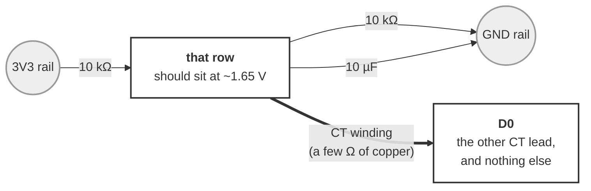

# Wiring — CT walk-around meter

**Untested.** Written alongside the firmware, not after using it.

Answers one question: **can a 30 A clamp tell a running tool from an idle one**,
well enough for DustGate's routing. Firmware:
[`../bench/ct_bench.cpp`](../bench/ct_bench.cpp), env `xiao_c5_ct_bench`.

## Wiring

**REWRITTEN 2026-09-06 — the first version was a confusing schematic and got the
rig built with D0 at ground, which reads a beautiful and entirely fictional
0.000 A.** So: as a build, not a drawing.

**Pick one empty row on the breadboard.** Everything either goes into that row or
it does not.

| | Goes from | To |
|---|---|---|
| 10 kΩ | the `3V3` rail | **that row** |
| 10 kΩ | **that row** | the `GND` rail |
| 10 µF | **that row** (long leg / `+`) | the `GND` rail |
| CT wire 1 | the CT | **that row** |
| CT wire 2 | the CT | **`D0`** |



That row ends up with four things in it: two resistor legs, the capacitor's `+`
leg, and one CT wire. **`D0` ends up with exactly one thing in it** — the other CT
wire — and that is the part that matters. D0 takes its DC level *through the CT
winding*, which is a few ohms of copper, so it rests halfway up the supply with
the CT's signal on top. Anything else on D0, ground above all, swamps the two
10 kΩ resistors and pins the input.

**The check, before believing any number.** Meter between that row and GND: it
should read **~1.65 V**, which is just the two resistors halving 3.3 V. The
console also prints `DC ####mV` on every status line and it should say the same.
`0mV` or `3300mV` means the input is railed, and every reading is meaningless —
the variance of a constant is zero, which looks exactly like a perfectly quiet
sensor.

Cut the 3.5 mm plug off the SCT-013 and use the bare wires; polarity does not
matter for an RMS reading.

**Check it before believing any number:** the console prints `DC ####mV` on every
line. It must read **~1650 mV**. `0mV` or `3300mV` means the input is railed and
every reading is meaningless — the variance of a constant is zero, which looks
exactly like a perfectly quiet sensor.

| | |
|---|---|
| CT | **SCT-013-030** — 30 A → 1 V RMS, burden built in. Confirm the listing says **30A/1V**; the 30A/1A variants have no burden |
| Bias | 2× 10 kΩ from 3V3 and GND, 10 µF from the midpoint to GND |
| ADC | **D0** (GPIO1) — the only analog pad on the edge |
| Screen | SSD1306 on **D4/D5**, 0x3C. Optional; probed at boot like every other board |
| Power | Any USB power bank |

**The exact divider does not matter.** The firmware measures the mean and
subtracts it, so a lazy midpoint and a drifting reference both come out in the
wash. There is no trim.

**⚠️ Clamp ONE conductor.** Around a whole appliance cord, hot and neutral cancel
and it reads about zero. Use a line splitter's **1X** loop, or clamp inside the
tool's own wiring compartment.

## Using it

```
zero      measure the NOISE FLOOR — clamp around a DE-ENERGISED conductor
clear     reset the peak hold
log <n>   n one-second samples as CSV
q         quiet: screen only
```

**Run `zero` first, and do it properly** — clamped around a dead wire, not
dangling in mid-air. A clamped jaw picks up differently from an open one, and the
floor is the number every other reading gets judged against.

Then walk: clamp a tool's hot leg, note the idle reading, switch it on, read the
peak. `clear` between tools.

## Where this stands — TABLED 2026-09-07, pending a better meter

**The sensor works. The front end does not, and the ADC path may not be the
place to fix it.** Numbers from the last clean run (bias confirmed at
`DC 1650mV`, so these count, unlike everything before 2026-09-07):

| | A | mV at the CT | |
|---|---|---|---|
| Board alone (phase C, CT unplugged, input shorted) | 0.158 | — | the ADC and divider by themselves |
| Floor (CT clamped on a **dead** wire) | 0.253 | 8.4 | |
| **CT's own contribution** | **0.208** | 6.9 | in quadrature, C against D |
| 15 W load, one conductor | 0.327 total | 10.9 | **0.208 A of signal, ≈25 VA** |
| 15 W load, whole cord | 0.262 | 8.7 | 0.068 A apparent — below the floor |

**The signal is real and correct.** A 15 W motor with a poor power factor showing
as ~25 VA is what it should look like, and it measured the same before and after
the divider change.

**The noise is not the ADC any more.** Dropping the divider from 10k/10k to
1k/1k took the board's own contribution from 0.228 A to 0.158 A — and the floor
barely moved, because attaching the CT adds 0.208 A on its own, on a dead
conductor. A CT is a coil, and it is sitting in the field of whatever live wiring
is near the bench.

**Unresolved, and the next step is a multimeter, not more firmware.** Read the CT
directly with the leads off the breadboard, AC volts, lowest range —
**millivolts × 30 = amps**. Four readings, and the ratios matter more than the
absolute values:

1. CT held **away from all wiring**, different part of the room
2. CT on the **dead wire** at the bench — should match the 8.4 mV above
3. **One conductor**, load on — should be ~10.9 mV
4. **Whole cord**, load on — ~8.7 mV

**1 against 2 is the decisive pair.** If 1 is much lower, everything called a
"floor" here is really "ambient field at this bench", and the fix is distance,
orientation and a grounded shield rather than anything electronic. If they match,
the noise is in the ESP32 path after all.

These are 1–11 mV readings, the bottom of a handheld's AC range where cheap
meters are average-responding and least accurate. Worth waiting for a bench meter.

**§5.4 is NOT answered.** The whole-cord reading is 34% of the one-conductor
signal — suggestive, not nothing — but it sits below the floor, so the run cannot
tell a real leakage from noise. The console now refuses to give a verdict rather
than reporting that as a clean negative.

The `Hz` column added on 2026-09-07 exists to settle the pickup question from the
board itself: ~60 Hz is magnetic pickup, anything above ~500 Hz is electronics.
It has not been read yet.

## What to expect, so a surprise is informative

Rough arithmetic, worth writing down so the measurement can contradict it:

- SCT-013-030 gives **33 mV RMS per amp**.
- ESP32 ADC noise is a few mV RMS, so the floor should land somewhere around
  **0.1 A — roughly 11 W at 120 V nominal**.

If that holds, then:

- **A running tool is trivially detectable.** Anything with a motor is amps, not
  milliamps — a hundred times the floor.
- **`DEFAULT_THRESHOLD_W` of 5 W is NOT.** Five watts is 0.04 A, or 1.4 mV —
  below the expected floor. That default was set for a smart plug's metering
  chip, which is 0.2% accurate on a 16 A range; a 30 A clamp is a far blunter
  instrument and the threshold on a CT-sensed tool will have to be much higher.

`zero` prints that comparison directly rather than leaving it as arithmetic. If
the floor comes in far lower than 0.1 A, good — say so, because it widens what
this sensor can be used for. If a small tool disappears into the floor, the
answer is a smaller-range CT for that tool (an SCT-013-005 is 5 A full scale, six
times the resolution), not a better threshold.

## The other thing worth measuring while you are out there

`shop-schema-rfc.md` §5.4: **does clamping an intact cord work at all?** iVAC
sells a product that claims to detect tool on/off from the field around an
unopened cord, which would make every install dramatically easier. This meter is
how you find out — read the line splitter's 1X loop, then the intact cord, back
to back, same tool. Any reading at all on the intact cord is the interesting
result; it does not have to be accurate, only repeatable.
